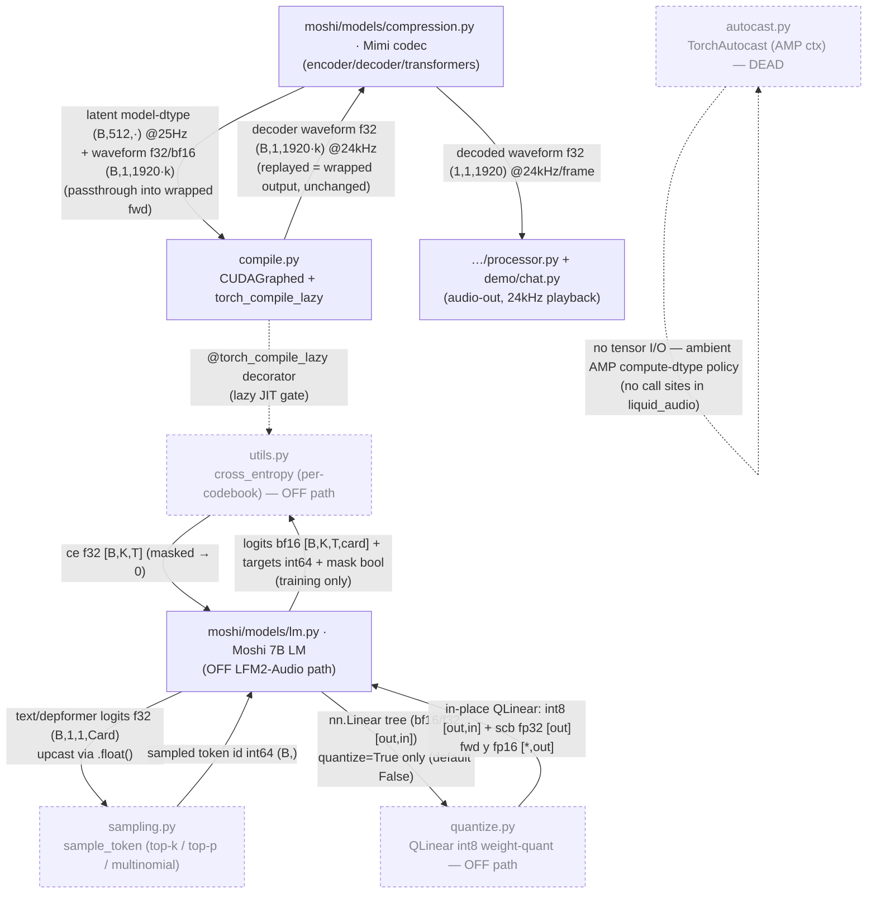

<!-- topic: Moshi Utilities -->
# Moshi utilities (CUDA graphs, sampling, autocast)

This folder is the **execution-plumbing toolbox** of Kyutai's vendored Moshi tree: CUDA-graph capture/replay + `torch.compile` gating, AMP autocast context management, the Moshi-LM next-token sampler, bitsandbytes int8 weight quantization, and the Moshi-LM training cross-entropy. None of these do codec/backbone tensor math themselves — they wrap or accelerate modules that live elsewhere. On the **LFM2-Audio mic→wav inference path only one component runs**: `compile.py` (`CUDAGraphed` / `torch_compile_lazy`), and even that is **numerically inert** — pure latency orchestration that wraps the Mimi codec on CUDA and degrades to an identity passthrough off-CUDA. Everything else here (`sampling.py`, `autocast.py`, `quantize.py`, `utils.py`) belongs to the off-path Moshi 7B LM / training stack and is **dormant or dead** in this checkout.

## Wiring

Solid edges into/out of `compile.py` ↔ the Mimi codec are the **only on-path tensor flow**. Dashed nodes (`sampling.py`, `autocast.py`, `quantize.py`, `utils.py`) are off the LFM2-Audio path. `autocast.py` has a self-loop because it produces no tensor and has zero call sites in `liquid_audio`.

## Components

| Component | File | dtype in → out | One-line role | Spec |
|---|---|---|---|---|
| `moshi_util_compile` | `compile.py` | passthrough: model-dtype latent `(B,512,·)` @25Hz / waveform f32·bf16 `(B,1,1920·k)` → **same** wrapped output, decoder waveform **f32** `(B,1,1920·k)` @24kHz | CUDA-graph capture/replay + `torch.compile` lazy-gating wrapping Mimi's encoder/decoder/transformers; numerically inert, disabled off-CUDA, no Rust counterpart (candle eager). **ON path.** | [./compile.md](MU02-CUDA-Graphs) |
| `moshi_util_sampling` | `sampling.py` | f32 logits `(…,Card)` (callers `.float()`-upcast) → int64 token id `(…,)` squeezed | Standalone Moshi-7B-LM next-token sampler (greedy argmax / temp-softmax + sort-cumsum top-p / gather top-k + sync-free multinomial). **OFF path** — LFM2-Audio uses its own inline threshold-top-k samplers. | [./sampling.md](MU01-Sampling) |
| `moshi_util_autocast` | `autocast.py` | no tensor I/O — ctor args `enabled:bool` + `torch.autocast(device_type, dtype=bf16/f16)`; `__enter__` → `None` | `torch.autocast` on/off context-manager wrapper (AMP compute-dtype policy). **OFF path & DEAD** — vendored, no call sites in `liquid_audio`. | [./autocast.md](MU03-Autocast) |
| `moshi_util_quantize` | `quantize.py` | `nn.Linear.weight` bf16/f32 `[out,in]` → int8 `[out,in]` + `weight_scb` fp32 `[out]`; fwd `x` any-float `[*,in]` → `y` fp16 `[*,out]` | bitsandbytes int8 weight-quant: `QLinear` (vector-wise int8 weight + fp32 scale, fp16-activation LLM.int8 matmul) + recursive `replace_linear_with_qlinear`. **OFF path** — Moshi LM/transformer only, `quantize=False` default; CUDA-only. | [./quantize.md](MU04-Int8-Quantize) |
| `moshi_util_utils` | `utils.py` | logits bf16 `[B,K,T,card]` + targets int64 `[B,K,T]` + mask bool `[B,K,T]` → ce f32 `[B,K,T]` (masked positions zeroed) | Vendored Moshi-LM **training** utility: chunked per-codebook `cross_entropy` (manual logsumexp − gather, optional tanh soft-clip, f32 upcast). **OFF path** — not imported anywhere in this checkout. | [./utils.md](MU05-Moshi-Utils) |

## How it fits

On the live LFM2-Audio path, **what enters this folder is one wrapped-module passthrough**: the Mimi codec (`moshi/models/compression.py`) constructs four `CUDAGraphed` wrappers in its streaming state and hands them its encoder/decoder/transformer modules plus per-frame tensor args — latent `(B,512,·)` @25Hz model-dtype and/or waveform f32/bf16 `(B,1,1920·k)`. **What leaves is bit-identical to what would have left without the wrapper**: the replayed graph re-runs the captured kernels in place and returns the wrapped module's own output — decoder waveform **f32 `(B,1,1920·k)` @24kHz** — which flows downstream to `…/processor.py` and `demo/chat.py` for 24 kHz playback (one f32 `(1,1,1920)` frame at a time). So `compile.py`'s upstream is the **`moshi/models/` (compression/Mimi)** folder and its downstream is the **top-level processor / demo audio-out** path; it adds latency on CUDA and nothing else. The only intra-folder edge is `utils.py`'s `cross_entropy` borrowing `compile.py`'s `@torch_compile_lazy` decorator — but `utils.py` has no caller here, so that edge never fires.

## Off the LFM2-Audio inference path (explicit)

Four of the five components in this folder **do not run** on the LFM2-Audio mic→wav path:

- **`sampling.py`** — the **Moshi 7B LM** sampler. LFM2-Audio reimplements sampling inline (`_sample_text_token` / `_sample_audio_frame` in `model/lfm2_audio.py`) with a *threshold* top-k (keeps ties at the k-th value) and **no top-p**, so it is not interchangeable with this fixed-`k`-gather sampler. Off-path; the Rust analog is `candle_transformers::generation::LogitsProcessor`, not a port of this file.
- **`autocast.py`** — **dead vendored code**: `TorchAutocast` has zero call sites in `liquid_audio`. The autocast the codebase actually uses is `accelerator.autocast()` (trainer) and `torch.amp.autocast(enabled=False)` guards (mel front-end / conformer), none routing through this class. The Rust port has no analog by design (explicit per-op dtype).
- **`quantize.py`** — Moshi-LM/transformer-only int8 weight quantization, gated by `quantize=True` (default **False** at both call sites) and **CUDA-only** (bitsandbytes). The LFM2-Audio backbone (`Lfm2Model` + depthformer) and the Mimi codec run full-precision bf16; no port.
- **`utils.py`** — the **Moshi 7B LM training** cross-entropy, with **no importer anywhere in this checkout**. LFM2-Audio's own loss uses stock `F.cross_entropy(reduction="none")` (`model/lfm2_audio.py:460,462`), a different code path (ported as `candle_ext::loss::cross_entropy_none`).

Only **`compile.py`** is on the inference path, and it is a numerically inert latency layer (disabled off-CUDA, no Rust counterpart since candle runs Mimi eagerly).
