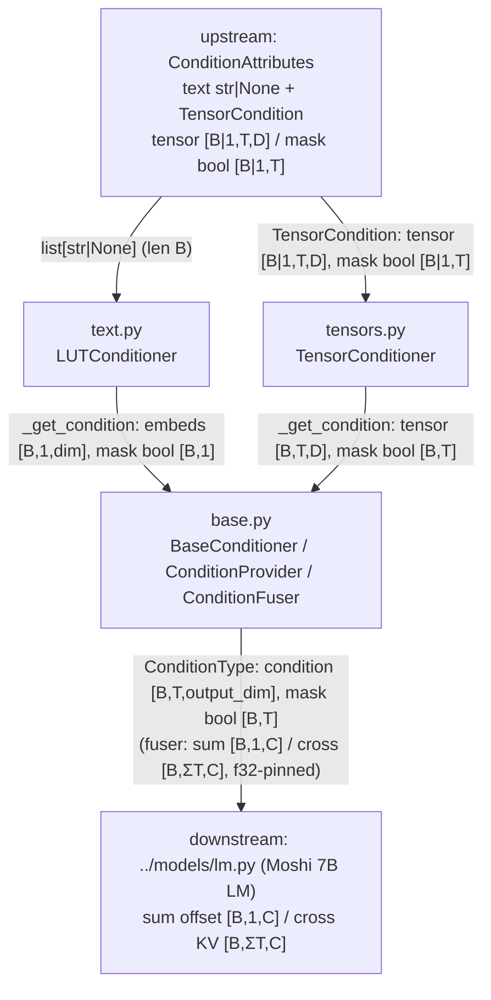

<!-- topic: Moshi Conditioners (off-path) -->
# Moshi Conditioners (off path)

Off-path LM conditioning (LUT/text/tensor) — not on the LFM2-Audio path. Each `##` keeps its architecture code.

---

## LM conditioners (off-path)

This folder is the **conditioning framework** vendored from Kyutai's Moshi / Meta's AudioCraft: it turns *external attributes* (a categorical text string, a pre-computed dense feature tensor) into dense `[B, T, output_dim]` embeddings and *fuses* them into a generative LM's stream as an additive offset (`sum`) or a cross-attention KV source (`cross`). It is the conditioning backbone of the **Moshi 7B multi-stream LM** and the Moshi `TTSModel`, reached only through `../models/lm.py` and `../models/tts.py`.

> **Off the LFM2-Audio inference path.** LFM2.5-Audio never instantiates any of this — it builds its own backbone + depthformer and fuses modalities by **index-scatter on a modality flag** (`../../processor.md`, `../../model/lfm2_audio.md`), not via a `ConditionProvider`/`ConditionFuser`. Nothing in `processor.py` / `model/lfm2_audio.py` imports the conditioners. There is no Rust port: the whole `liquid_audio/moshi/**` tree is "reused as the `moshi` crate, not re-ported" (PYTHON_VS_RUST.md §4), and the `moshi` crate is loaded only for the Mimi codec — `grep -ri condition` over `liquid-audio-rs/src/` returns nothing. Documented here for inventory completeness only.

## Component flow



The two concrete embedders (`text.py`, `tensors.py`) are both `BaseConditioner` subclasses defined in `base.py`; they supply the abstract `prepare` / `_get_condition` hooks, and `base.py`'s inherited `forward` does the shared `output_proj` (`dim → output_dim`, biasless `Linear`) + masked learnt-padding blend. `ConditionProvider` (in `base.py`) collates a batch and runs every conditioner; `ConditionFuser` (in `base.py`) combines the resulting `(condition, mask)` pairs into the LM's `sum` offset and `cross` KV source. There is **no attention, RoPE, RMSNorm/LayerNorm, convolution, activation, quantization, or sampling** anywhere in this folder — the only numerically interesting op is the masked blend.

## Components

| Component | File | dtype in → out | Role | Spec |
|---|---|---|---|---|
| `LUTConditioner` | `text.py` | `list[str\|None]` (len B) → `ConditionType(condition model-dtype bf16/f32 [B,1,output_dim], mask bool [B,1])` | Lookup-table **text** conditioner: `NoopTokenizer` (hash/index per attribute string) → `nn.Embedding` → biasless `Linear` → masked `learnt_padding` blend. | [./text.md](Moshi-Conditioners) |
| `TensorConditioner` | `tensors.py` | `TensorCondition(tensor model-dtype/f32 [B\|1,T,D], mask bool [B\|1,T])` → `ConditionType(condition model-dtype/f32 [B,T,output_dim], mask bool [B,T])` | Raw-tensor conditioner: device-move + identity rewrap of `(tensor, mask)`; projection/blend inherited from `BaseConditioner`. "Does basically nothing." | [./tensors.md](Moshi-Conditioners) |
| `BaseConditioner` / `ConditionProvider` / `ConditionFuser` | `base.py` | per-attribute `cond [B,T,dim]` + `mask bool [B,T]` → `ConditionType(condition [B,T,output_dim], mask bool [B,T])`; fuser → `sum [B,1,C]` / `cross [B,ΣT,C]` (f32-pinned, cast to LM dtype at boundary) | Conditioning framework: per-attribute embed+project+masked-pad, batch collate+run, and sum/cross/prepend fusion. | [./base.md](Moshi-Conditioners) |

## How it fits

**Enters:** a batch of `ConditionAttributes` assembled by a Moshi dataset/runner — a `text` dict of `str|None` attribute strings (len `B`), plus a `TensorCondition` dict of dense `[B|1, T, D]` feature tensors with bool `[B|1, T]` masks. `text.py` consumes the strings, `tensors.py` consumes the tensors, and `ConditionProvider._collate_*` (in `base.py`) right-pads them into batched tensors.

**Leaves:** per-attribute `ConditionType(condition, mask)` pairs — `condition` is model-dtype `[B, T, output_dim]`, `mask` is bool `[B, T]` — which `ConditionFuser` reduces to a `sum_condition` additive offset `[B, 1, C]` and/or a `cross_attention_src` KV source `[B, ΣT, C]`. The provider is **pinned to float32** at the LM level (`lm.py:228`), and `sum`/`cross` are cast back to the LM's compute dtype at the boundary (`lm.py:393`, `lm.py:618-621`); the sinusoidal pos-emb added to `cross` is likewise built in f32 then cast (half-split `[cos, sin]` layout — *not* interleaved RoPE).

**Upstream folder:** loaders in [`../models/loaders.md`](MM02-Mimi-Loaders) (`get_conditioner_provider` / `get_condition_fuser`) build the `ConditionProvider` / `ConditionFuser` instances; the sinusoidal helper `create_sin_embedding` comes from [`../modules/transformer.md`](MO03-Codec-Transformer). **Downstream folder:** [`../models/lm.md`](MM03-Moshi-LM) is the only real consumer (`LMModel.forward` / `LMGen` feed the `sum` offset and `cross` KV into the Moshi-7B transformer); [`../models/tts.md`](MM05-Moshi-TTS) also constructs these conditioners and reads `LUTConditioner.tokenizer.possible_values` to validate CFG values.

**Status:** every component in this folder is **off the LFM2-Audio inference path** (Moshi LM / TTS only) and has **no Rust counterpart** — same off-path status PYTHON_VS_RUST.md §4 assigns to the entire Moshi LM/conditioning stack, distinct from the on-path Mimi reuse in §2.3.

---

## CN01 · ConditionProvider / Fuser
**Code:** `CN01` · **Source:** `moshi/conditioners/base.py` · **Rust:** `-` · **On the LFM2-Audio inference path:** no

## Role
This file is the conditioning framework vendored from Kyutai's Moshi / Meta's AudioCraft: it defines how *external attributes* (a text genre string, a raw tensor) are embedded into dense vectors and *fused* into a generative LM's stream. It supplies three things — `BaseConditioner` (per-attribute embed + pad + project), `ConditionProvider` (collate a batch of `ConditionAttributes` and run every conditioner), and `ConditionFuser` (combine the resulting `(embedding, mask)` pairs by `sum` / `prepend` / `cross`). It is the conditioning backbone of the Moshi 7B multi-stream LM (`moshi_lm`), not of LFM2-Audio. **LFM2.5-Audio never instantiates any of it** — its inputs are scattered by modality flag in `model/lfm2_audio.py`, not conditioned/fused — so this whole module is reference-only (off-path) and has no Rust port.

## How it works
The module is three cooperating `nn.Module`s plus a `ConditionAttributes` data container.

**`BaseConditioner.__init__` (`base.py:105`).** Generic over a `Prepared` type. Holds an `output_proj` that is `nn.Linear(dim, output_dim, bias=output_bias)` when `force_linear` (default `True`) or `dim != output_dim`, else `nn.Identity` (`base.py:118`). There is an `assert not output_bias` guard so the linear is bias-free in the forced case. An optional learnt padding vector `learnt_padding` is a `Parameter` of shape `(1,1,output_dim)`, initialized `randn` then scaled in-place by `0.2` (`base.py:125-127`); `None` if `learn_padding=False`.

**`BaseConditioner.forward` (`base.py:151`) — the per-attribute pipeline:**
1. `cond, mask = self._get_condition(inputs)` — abstract; subclasses (`LUTConditioner`, `TensorConditioner`) produce `cond` of shape `[B,T,dim]` and a bool `mask` of `[B,T]`. The base raises `NotImplementedError` (`base.py:139,149`).
2. Empty-pad guard (`base.py:153-156`): if `T==0` and `pad_empty`, it rebuilds a zero `cond` of `[B,T,C]` and a zero bool mask. (Note: this branch keeps `T==0`; it is a degenerate guard, not a length-1 re-pad despite the docstring.)
3. **Projection:** `cond = self.output_proj(cond)` — a single dense projection `dim → output_dim`, no normalization, no activation.
4. **Masked padding blend (`base.py:160-164`):** `maskf = mask.float()[..., None]` upcasts the bool mask to a `[B,T,1]` float gate; then
   ```python
   cond = cond * maskf + self.learnt_padding * (1 - maskf)   # learnt pad
   cond = cond * maskf                                        # zero pad
   ```
   i.e. valid positions keep the projected embedding, padded positions are replaced by the (broadcast) learnt-padding vector or zeroed. Returns a `ConditionType(cond, mask)` NamedTuple (`base.py:25`). There is **no attention, no RoPE, no RMSNorm/LayerNorm, no convolution, no quantization** here — it is embed → linear → masked-select.

**`ConditionProvider` (`base.py:225`)** wraps a `nn.ModuleDict` of named conditioners and partitions them via `isinstance` into `text_conditions` (`_BaseTextConditioner`) and `tensor_conditions` (`_BaseTensorConditioner`) (`base.py:238-244`).
- `_collate_text` (`base.py:246`) transposes a list of `ConditionAttributes` into `{attr: [str|None, ...]}` via a `defaultdict(list)`.
- `_collate_tensors` (`base.py:273`) stacks per-attribute `TensorCondition`s with `TensorCondition.cat` (`base.py:46`), which right-pads each `[1,T,D]` tensor to `T=max` into a `[B,T,D]` zero buffer and copies the per-item bool masks — classic right-padding collation (`base.py:53-59`).
- `prepare` (`base.py:293`) collates, asserts the attribute keyset is a subset of the registered conditioners, raises if any conditioner got no input, then calls each conditioner's `prepare(batch)` (the "sync-point" stage: BPE tokenize + host→device transfer, separated so the GPU forward has no stalls). `forward` (`base.py:325`) then runs each conditioner module on its prepared batch and returns `{name: ConditionType(condition, mask)}`. `prepare_and_provide` (`base.py:343`) chains the two.

**`ConditionFuser` (`base.py:349`)** maps each condition name to one of `FUSING_METHODS = ["sum","prepend","cross"]` via `cond2fuse`, and at construction it actually *rejects* `prepend` (`base.py:379-381` raises unless the method is `sum` or `cross`) — so the live fuse paths are sum and cross.
- `get_sum` (`base.py:411`): for every `sum`-tagged condition, assert `cond.shape[1] == 1` (a single time step) and accumulate `sum = sum + cond`. This is a per-step **additive offset** broadcast over the whole sequence — used by the LM as `input_ = input_ + sum_condition` (`moshi/models/lm.py:392-393`).
- `get_cross` (`base.py:392`): concatenate all `cross`-tagged conditions along `dim=1` (time) to build the cross-attention key/value source. Optionally adds a sinusoidal positional embedding: `positions = arange(T).view(1,-1,1)`, `pos_emb = create_sin_embedding(positions, C).to(cross.dtype)`, `cross = cross + scale * pos_emb` (`base.py:402-408`). `create_sin_embedding` (`moshi/modules/transformer.py:130`) is the standard half-split table: `half_dim = dim//2`, `phase = positions / (max_period ** (arange(half_dim)/(half_dim-1)))` with `max_period=10000`, returning `cat([cos(phase), sin(phase)], dim=-1)` — i.e. a **concatenated (half-split) cos/sin layout, computed in f32 by default** then cast to the cross dtype.
- `get_prepend` (`base.py:423`): concatenates `prepend`-tagged conditions and, if any, folds in `get_sum`. Present in the API but unreachable through the constructor's guard.

**Dropout utilities** (`dropout_tensor`/`dropout_condition_`/`dropout_all_conditions`, `base.py:176-222`) zero out a condition's tensor+mask (the AudioCraft classifier-free-guidance nullification), used by the LM's CFG path, not by any embedding math here.

## Dtypes & shapes
| Stage | Input dtype+shape | Output dtype+shape |
|---|---|---|
| `BaseConditioner._get_condition` (subclass) | prepared batch (token ids int64 / raw tensor) | `cond` model dtype `[B,T,dim]`, `mask` bool `[B,T]` |
| `output_proj` (Linear `dim→output_dim`) | model dtype `[B,T,dim]` | model dtype `[B,T,output_dim]` |
| masked blend (`base.py:160-164`) | `cond` model dtype `[B,T,output_dim]`, `mask` bool `[B,T]` → `maskf` f32 `[B,T,1]` | model dtype `[B,T,output_dim]` |
| `TensorCondition.cat` collate | list of `[1,Tᵢ,D]` (mask bool `[1,Tᵢ]`) | `[B,max T,D]`, mask bool `[B,max T]` |
| `ConditionFuser.get_sum` | each `[B,1,C]` model dtype | `[B,1,C]` model dtype (additive offset) |
| `ConditionFuser.get_cross` | each `[B,Tᵢ,C]` model dtype | `[B,ΣTᵢ,C]` model dtype (+ f32 sin pos-emb cast to cross dtype) |
| `create_sin_embedding` | `positions` long `[1,T,1]` | f32 (default) `[1,T,dim]`, then `.to(cross.dtype)` |

Internal promotions: the mask is upcast bool→f32 (`mask.float()`) for the blend; `create_sin_embedding` builds its table in **f32** then casts to the cross dtype. Moshi keeps `condition_provider` pinned to **float32** at the LM level (`moshi/models/lm.py:228` "We always keep the condition provider as float32"), and the LM casts `sum`/`cross` back to model dtype before use (`lm.py:393`, `lm.py:618-621`). No int64 token-id math, no u32 codes, no f64 here.

## Wiring
**Upstream (feeds this):** a batch of `ConditionAttributes` (text dict + `TensorCondition` dict) assembled by a Moshi dataset/runner; the concrete embedders are [moshi_cond_text](Moshi-Conditioners) (`LUTConditioner`) and [moshi_cond_tensors](Moshi-Conditioners) (`TensorConditioner`), both subclasses of `BaseConditioner` here. The sinusoidal helper comes from [moshi_transformer](MO03-Codec-Transformer) (`create_sin_embedding`). Loaders [moshi_loaders](MM02-Mimi-Loaders) (`get_conditioner_provider`/`get_condition_fuser`, `loaders.py:437-453`) build the `ConditionProvider`/`ConditionFuser` instances.

**Downstream (consumes this output):** [moshi_lm](MM03-Moshi-LM) is the only real consumer — `LMModel.__init__` stores `condition_provider`/`fuser` (`lm.py:104-105,229-234`); `LMModel.forward` calls `fuser.get_sum`/`fuser.get_cross` to produce `sum_condition` `[B,1,C]` and `cross_attention_src` `[B,ΣT,C]` (model dtype after cast), feeding the transformer as an additive input offset and cross-attention KV source (`lm.py:354-357,392-396`); `LMGen` does the same on the streaming path (`lm.py:616-621`). **No LFM2.5-Audio component consumes this** — neither [core_processor](CO01-Processor-ChatState) nor [model_lfm2_audio](MD01-LFM2AudioModel) nor [model_lfm2_backbone](MD01-LFM2AudioModel) imports the conditioners; LFM2-Audio fuses modalities by index-scatter, not by this provider/fuser.

## Python ↔ Rust
No Rust counterpart. The Rust port's `compare_symbols.py` core scope **excludes all of `moshi/`** (PYTHON_VS_RUST.md §4: "the vendored Python `liquid_audio/moshi/**` is reused as the `moshi` crate, not re-ported"). The `moshi` crate that `liquid-audio-rs` depends on is used **only for the Mimi codec** (`moshi::mimi`, ARCHAEOLOGY.md Q1) — its conditioner/LM modules are never loaded by this project. So there is no `ConditionProvider`/`ConditionFuser`/`BaseConditioner` symbol in `liquid-audio-rs/src/` (grep for "condition" returns nothing), and no deliberate divergence to record because the component is never on the port surface. This is the same off-path status PYTHON_VS_RUST.md §4 assigns to the whole `moshi/**` LM/conditioning stack, distinct from the on-path Mimi reuse in §2.3.

## Precision / gotchas
- **f32-pinned conditioning.** The provider is deliberately kept in float32 by its only consumer (`lm.py:228`); `sum`/`cross` are cast to the LM's compute dtype at the boundary (`lm.py:393`, `lm.py:618-621`). The sinusoidal pos-emb is also built in f32 then cast (`base.py:407`, `create_sin_embedding` default `dtype=torch.float32`) — this is the "extended precision until the boundary" pattern, here at the conditioning edge rather than the mel front-end.
- **`get_sum` requires length-1.** `assert cond.shape[1] == 1` (`base.py:416`) — a `sum` condition must be a single broadcastable step; a multi-step sum condition is a hard error.
- **`prepend` is dead.** Despite being in `FUSING_METHODS` and having a full `get_prepend`, the `ConditionFuser` constructor raises on any method other than `sum`/`cross` (`base.py:379-381`), so `has_prepend`/`get_prepend` are unreachable through normal construction.
- **Empty-pad branch is a no-op resize.** The `T==0` guard (`base.py:153-156`) rebuilds zero tensors that are still length-0, contrary to the docstring's "padded to have length 1"; downstream collation/`get_sum` is what enforces real lengths.
- **Sinusoidal layout is half-split, not interleaved.** `create_sin_embedding` concatenates `[cos, sin]` blocks (`transformer.py:154`) — different from the *interleaved* RoPE (`rope_i`) used in the LFM2 depthformer ([model_transformer](MD04-Depthformer)); do not conflate the two.
- **No norm/attention here.** Unlike most components in this codebase, `base.py` has no RMSNorm/LayerNorm order question, no `1/sqrt(d)` attention scale, no causal mask — the masked blend (`base.py:162`) is the only numerically interesting op, and it is exact (multiply + add of a bool-derived f32 gate). The classifier-free-guidance dropout (`base.py:176-222`) is the only thing that mutates condition values, and it zeroes them exactly.

---

## CN02 · LUTConditioner
**Code:** `CN02` · **Source:** `moshi/conditioners/text.py` · **Rust:** `-` · **On the LFM2-Audio inference path:** no

## Role
`LUTConditioner` is Moshi's lookup-table **text conditioner**: it maps a small set of categorical *attribute strings* (genre, key, speaker label, classifier-free-guidance flag, etc.) into a learned dense embedding `[B, T, output_dim]` plus a validity mask, so the Moshi 7B LM and the Moshi `TTSModel` can be steered by metadata. It is a `BaseConditioner` subclass driven by a `NoopTokenizer` (one index per whole string, not per word). **It is vendored Moshi machinery and is *not* part of LFM2.5-Audio:** the only importers are the off-path `moshi/models/lm.py` (via `ConditionProvider`/`ConditionFuser`) and `moshi/models/tts.py` (`text.py:26`). LFM2-Audio builds its own backbone + depthformer and never constructs a `ConditionProvider`, so nothing in `processor.py` / `model/lfm2_audio.py` reaches this code. It is documented here for inventory completeness; the Rust port deliberately omits it (reuse-the-`moshi`-crate, off-path; PYTHON_VS_RUST.md §4).

## How it works
Two-phase contract inherited from `BaseConditioner` (`base.py:93`): a sync-point `prepare()` (CPU tokenize → device transfer) and a tensor-only `forward()` (`base.py:151`). The phases exist so BPE/host work happens before GPU work to avoid a CUDA sync mid-step.

- **Tokenize — `NoopTokenizer.__call__` (`text.py:85`).** For each input string in the batch list:
  - `None` (attribute absent) → emit `pad_idx = n_bins` and length `0`.
  - present, no `possible_values` → `hash_trick(text, n_bins)` = `sha256(utf-8) mod n_bins` (`text.py:34-44`), a deterministic hash bucket. There is **no** collision handling — two distinct strings can alias to the same bin.
  - present, with `possible_values` → exact dict index (`text.py:98`), raising on an unknown value.
  Each present item has length `1` (a single "token" per attribute — this is a *global/categorical* conditioner, not a sequence). Result: `tokens = int tensor [B, 1]` (`text.py:101`, `.int()[:, None]`) and `mask = length_to_mask(lengths)` (`text.py:102`). `length_to_mask` (`text.py:18-31`) builds a bool `[B, Lmax]` via `arange(Lmax)[None,:] < lengths[:,None]`; with all lengths ∈ {0,1} and `final_length = max(maxlen, 1)`, the mask is `[B, 1]` — `True` for present, `False` for absent/padded.

- **prepare — `LUTConditioner.prepare` (`text.py:125`).** Tokenize on CPU, then move both tokens and mask to the embedding's device (`self.embed.weight.device`). Returns a `TokenizedText` NamedTuple. The `.to(device)` is double-applied (lines 128 and 129) — harmless idempotent transfer, no functional effect.

- **embed — `LUTConditioner._get_condition` (`text.py:131`).** A single `nn.Embedding(n_bins + 1, dim)` lookup (`text.py:118`; `+1` row reserved for `pad_idx`). `embeds = self.embed(tokens)` → `[B, 1, dim]`. Constructor scales the LUT once at init by `init_scale` (`text.py:119`, `.weight.data *= init_scale`). Returns `ConditionType(embeds, mask)`.

- **project + pad-fill — `BaseConditioner.forward` (`base.py:151-165`).** This is where the actual numerics finish (the subclass only supplies the raw LUT lookup):
  1. If `T == 0` and `pad_empty`, replace with a zero tensor + zero mask (defensive; the noop path always yields `T == 1`).
  2. `cond = self.output_proj(cond)` — a **biasless** `nn.Linear(dim → output_dim)` when `force_linear or dim != output_dim`, else `Identity` (`base.py:118-122`). `output_bias` is asserted `False` (`base.py:120`). This is the only matmul; there is **no normalization, no attention, no activation, no RoPE, no convolution** in this component.
  3. **Learned-padding blend (`base.py:160-164`):** `maskf = mask.float()[..., None]`; `cond = cond * maskf + learnt_padding * (1 - maskf)`. So *present* attributes pass through the projected embedding; *absent* ones (`mask == 0`) are overwritten by a learned per-feature vector `learnt_padding` (`[1,1,output_dim]`, init `randn * 0.2`, `base.py:125-127`). With `learn_padding=False`, absent positions are zeroed instead.

There is no streaming state, no causal mask, no sampling — a single embedding gather + linear projection + masked blend, applied once per attribute per forward.

**Fusion (downstream of this module, in `base.py`).** `ConditionProvider.forward` (`base.py:325`) runs each conditioner and returns `{name: ConditionType}`. `ConditionFuser` (`base.py:349`) then combines them by method: `prepend` (concat onto the transformer sequence, `get_prepend` `base.py:423`), `sum` (a shared per-step offset, asserts `cond.shape[1]==1`, `get_sum` `base.py:411`), or `cross` (concat into the cross-attention KV, `get_cross` `base.py:392`, optionally adding a sinusoidal pos-emb via `create_sin_embedding`). Only `sum`/`cross` are accepted at construction time (`base.py:379-381`).

## Dtypes & shapes
| Stage | Input | Output |
|---|---|---|
| `NoopTokenizer.__call__` | `list[str | None]` (len B) | `tokens int [B,1]`, `mask bool [B,1]` |
| `prepare` | same list | `TokenizedText(tokens int64→on-device, mask bool)` |
| `_get_condition` (LUT) | `tokens int [B,1]` | `embeds (model dtype, bf16/f32) [B,1,dim]`, `mask bool [B,1]` |
| `output_proj` (Linear, biasless) | `[B,1,dim]` | `[B,1,output_dim]` |
| learned-pad blend | `cond [B,1,output_dim]`, `mask bool [B,1]` | `cond [B,1,output_dim]` |
| `ConditionType` (final) | — | `condition (model dtype) [B,1,output_dim]`, `mask bool [B,1]` |

Dtype notes: token ids are `int` (`text.py:101` `.int()` — int32, *not* int64; the LUT `nn.Embedding` accepts either). The embedding weight and the `output_proj` weight follow the module dtype — **bf16** under Moshi's CUDA default, **f32** on CPU. The mask→`float()` blend (`base.py:160`) promotes the `[B,1]` mask to f32 for the multiply, broadcasting against the (bf16/f32) cond — a mixed-dtype multiply that follows torch promotion. There is **no** f32/f64 upcast for norm/softmax here (this module has neither). `hash_trick` is a pure-Python `int` (256-bit sha256 → `mod n_bins`), never a tensor.

## Wiring
Off-path; none of these edges touch the LFM2-Audio tensor flow.

- **Upstream:** `ConditionProvider.prepare` (`base.py:293`) collates per-attribute string batches from `ConditionAttributes.text` dicts and calls `LUTConditioner.prepare`; in the Moshi TTS path the attributes come from [moshi_tts](MM05-Moshi-TTS) script/speaker metadata. Edge: `list[str|None]` (len B) → this module. See [moshi_cond_base](Moshi-Conditioners).
- **Downstream:** the projected `ConditionType [B,1,output_dim]` (model dtype) is consumed by [moshi_cond_base](Moshi-Conditioners)'s `ConditionFuser` (`get_sum`/`get_cross`/`get_prepend`), which injects it into the [moshi_lm](MM03-Moshi-LM) Moshi-7B transformer (sum offset, prepended token, or cross-attention KV) — *not* into the LFM2-Audio backbone. `moshi/models/tts.py` (`text.py:26`) also reads `LUTConditioner.tokenizer.possible_values` directly to validate CFG conditioning values ([moshi_tts](MM05-Moshi-TTS), `tts.py:441-443`).

## Python ↔ Rust
No Rust counterpart exists. `liquid-audio-rs/src/` contains **zero** references to `LUTConditioner`, `NoopTokenizer`, `hash_trick`, `length_to_mask`, `TextConditioner`, or `conditioners/text` (grep-verified). This is a **deliberate omission**, not a gap:

- The whole vendored `liquid_audio/moshi/**` tree is "reused as the `moshi` crate, not re-ported" and is excluded from the port's `core` parity scope by design (PYTHON_VS_RUST.md §4; PORT_STATUS.md table row `moshi/* → ♻ reuse the moshi crate`).
- The conditioning subsystem (`ConditionProvider`/`ConditionFuser`/`LUTConditioner`) is only wired into the Moshi 7B LM and `TTSModel`, which are themselves off-path (`moshi_lm`, `moshi_tts` are "reference only / off-path"). LFM2-Audio's Rust pipeline ([model_lfm2_audio](MD01-LFM2AudioModel)) never instantiates a conditioner.
- Even the Mimi codec path actually used by the Rust port (Kyutai's `moshi::mimi` crate) does not pull in the conditioners module.

Symbol map: `LUTConditioner` / `NoopTokenizer` / `BaseConditioner.forward` / `ConditionFuser` → *(none)*. If ever needed, the natural candle shape would be `candle_nn::Embedding` (LUT) + biasless `candle_nn::Linear` (output_proj) + a masked `where`-blend for `learnt_padding`, mirroring the candle-ops-over-CUDA-kernels strategy used elsewhere (PYTHON_VS_RUST.md §2.2).

## Precision / gotchas
- **Not on the inference path** — the single most important fact: changing this file cannot affect LFM2-Audio output. It steers only the Moshi-7B LM / TTS reference models.
- **`hash_trick` collisions (`text.py:34`).** With no `possible_values`, distinct strings can map to the same of `n_bins` buckets and share an embedding row. Silent by design — fine for the "robust hashing of free-form tags" use case, surprising if you expected injective ids.
- **`pad_idx == n_bins` (`text.py:78`)** is the extra `+1` embedding row (`text.py:118`). Absent attributes (`None`) tokenize to this index *and* get `mask=0`, so the masked blend (`base.py:162`) overwrites whatever that row produced with `learnt_padding` — the pad row's embedding is effectively dead weight on the forward (it matters only if `learn_padding=False`, where absent → zero).
- **`output_proj` is biasless** (asserted, `base.py:120`); a mask of all-zeros yields a clean `learnt_padding`-only (or zero) output with no bias leakage.
- **Mask dtype crossing (`base.py:160`).** `mask.float()` × bf16 `cond` is a mixed-precision multiply; under torch promotion it lands in the wider dtype. Order is *multiply present, add learned-pad* — there is no normalize/cast subtlety like the RMSNorm-bf16 ordering elsewhere in the model (this module has no norm).
- **`.int()` not `.int64()` (`text.py:101`).** Token ids are int32; the embedding lookup is dtype-agnostic so this is harmless, but it differs from the int64 token ids used on the real LFM2-Audio text path ([core_processor](CO01-Processor-ChatState)).
- **EOAudio / special tokens are irrelevant here** — this conditioner has no audio codes and no autoregressive vocabulary; the `2048=EOAudio` and `65536` text-vocab facts apply to the on-path heads, not to this LUT.

---

## CN03 · TensorConditioner
**Code:** `CN03` · **Source:** `moshi/conditioners/tensors.py` · **Rust:** `-` · **On the LFM2-Audio inference path:** no

## Role
`TensorConditioner` is the raw-tensor conditioner of Kyutai's Moshi / AudioCraft conditioning framework: given a pre-computed dense feature tensor (with a validity mask) it performs no embedding of its own — it just moves the tensor to the module's device and hands it back, letting [moshi_cond_base](Moshi-Conditioners)'s `BaseConditioner.forward` do the projection + masked-pad. Its docstring is literally "Does basically nothing." It is instantiated only by the Moshi 7B multi-stream LM loader (`get_conditioner(... type=="tensor")`), never by LFM2.5-Audio, so this whole file is reference-only (off-path) with no Rust port.

## How it works
The file is 17 lines: one class, two methods, both trivial. All of the numerically interesting work (projection, learnt-padding blend, fusing) lives in the parent `BaseConditioner` / `ConditionFuser` — see [moshi_cond_base](Moshi-Conditioners). `TensorConditioner` only customizes the two abstract hooks that `BaseConditioner` declares (`prepare`, `_get_condition`).

**`prepare(tensor: TensorCondition)` (`tensors.py:11-13`) — the sync-point hook.** `BaseConditioner.prepare` is abstract and is documented as "any part of the processing that will lead to a synchronization point" (`base.py:131-137`); `ConditionProvider.prepare` calls it once, before the GPU forward, so the host→device transfer is hoisted out of the hot path (`base.py:319-322`). `TensorConditioner.prepare` reads the module's device off the first parameter — `device = next(iter(self.parameters())).device` (`tensors.py:12`) — which works because `BaseConditioner.__init__` always allocates at least the `output_proj` `nn.Linear` and (by default) the `learnt_padding` parameter (`base.py:118-127`). It then returns a **new** frozen `TensorCondition` with both fields `.to(device=device)` (`tensors.py:13`). It does **not** change dtype, shape, layout, or values — it is a pure device move of `(tensor, mask)`. The result is the `Prepared` value stored and replayed into `forward` later.

**`_get_condition(inputs: TensorCondition)` (`tensors.py:15-16`) — the embed hook.** For most conditioners this is where raw inputs become a dense `[B,T,dim]` embedding (e.g. `LUTConditioner` does a BPE lookup table). `TensorConditioner` skips that entirely: the input is *already* a dense tensor, so it just rewraps it as a `ConditionType(inputs.tensor, inputs.mask)` NamedTuple (`tensors.py:16`, `ConditionType` at `base.py:25`). No reshape, no cast, no normalization, no projection here — the only transform is the NamedTuple rewrap from `TensorCondition` → `ConditionType`.

**Where the actual math happens (inherited, not in this file).** `BaseConditioner.forward` (`base.py:151-165`) takes `_get_condition`'s `(cond, mask)` and:
1. empty-pad guard: if `T==0` and `pad_empty`, rebuild zero `cond`/`mask` (`base.py:153-156`);
2. **projection** `cond = self.output_proj(cond)` — an `nn.Linear(dim, output_dim, bias=False)` when `force_linear` (default) or `dim != output_dim`, else `nn.Identity` (`base.py:118-122,158`). This is the single dense op; for `TensorConditioner` it maps the supplied feature dim `dim` → the LM's `output_dim`;
3. **masked-pad blend** (`base.py:160-164`): `maskf = mask.float()[...,None]` (bool→f32 gate `[B,T,1]`), then `cond = cond*maskf + learnt_padding*(1-maskf)` (or `cond*maskf` if `learn_padding=False`) — valid positions keep the projection, padded positions take the learnt vector / zero.

So the data path for a tensor condition is: caller supplies `[B|1,T,D]` features → `prepare` device-moves → `_get_condition` rewraps → inherited `forward` does `Linear(D→output_dim)` + masked blend → `ConditionType`. There is **no attention, RoPE, RMSNorm/LayerNorm, convolution, activation, quantization, or sampling** anywhere in this component.

**Collation & masking detail.** Multiple single-item `TensorCondition`s (`[1,Tᵢ,D]`) are batched upstream by `TensorCondition.cat` (`base.py:46-59`): a `[B, maxT, D]` zero buffer is filled per item (right-padding) and the per-item bool masks copied into a `[B, maxT]` mask. `TensorCondition.from_tensor` (`base.py:40-44`) builds an all-`True` mask via `torch.ones(B,T,dtype=torch.bool)` when none is supplied. These live in `base.py`, not here, but define the `(tensor, mask)` contract `TensorConditioner` consumes.

## Dtypes & shapes
| Stage | Input dtype+shape | Output dtype+shape |
|---|---|---|
| `prepare` (`tensors.py:11`) | `TensorCondition(tensor: model dtype `[B\|1,T,D]`, mask: bool `[B\|1,T]`)` on any device | same `TensorCondition`, `.to(device)` — dtype/shape/values unchanged |
| `_get_condition` (`tensors.py:15`) | `TensorCondition(tensor `[B,T,D]`, mask bool `[B,T]`)` | `ConditionType(condition = tensor `[B,T,D]` model dtype, mask bool `[B,T]`)` |
| inherited `output_proj` (`base.py:158`) | model dtype `[B,T,D]` (D = `dim`) | model dtype `[B,T,output_dim]` |
| inherited masked blend (`base.py:160-164`) | `cond` model dtype `[B,T,output_dim]`, `mask` bool `[B,T]` → `maskf` **f32** `[B,T,1]` | model dtype `[B,T,output_dim]` |

Promotions: none introduced by this file. The only upcast in the whole pipeline is the inherited `mask.float()` (bool→f32 gate, `base.py:160`); the feature tensor stays in whatever dtype the caller supplied. By convention the Moshi LM pins its `condition_provider` to **float32** (`moshi/models/lm.py:228` "We always keep the condition provider as float32") and casts `sum`/`cross` back to model dtype at the LM boundary. No int64 token ids, no u32 codes, no f64 anywhere here.

## Wiring
**Upstream (feeds this):** a caller-supplied dense feature tensor wrapped as a `TensorCondition` (`[B|1,T,D]` model/f32 + bool `[B|1,T]` mask), collated by [moshi_cond_base](Moshi-Conditioners)'s `ConditionProvider._collate_tensors` → `TensorCondition.cat` (model dtype `[B,maxT,D]` + bool mask `[B,maxT]`). The instance is built by [moshi_loaders](MM02-Mimi-Loaders) `get_conditioner` when the config's `conditioner_cfg["type"] == "tensor"` (`loaders.py:429-430`), which injects `output_dim` (the LM model dim) and `device` into the kwargs (`loaders.py:424`) and registers it in the `ConditionProvider` (`loaders.py:437-447`). The base class it extends is [moshi_cond_base](Moshi-Conditioners) (`_BaseTensorConditioner` → `BaseConditioner`).

**Downstream (consumes this output):** [moshi_lm](MM03-Moshi-LM) is the only real consumer. The `ConditionProvider` runs this conditioner and yields `{name: ConditionType(cond model-dtype `[B,T,output_dim]`, mask bool `[B,T]`)}`; `ConditionFuser.get_sum`/`get_cross` (`base.py:392-421`) turn those into a `sum_condition` (`[B,1,output_dim]`) additive offset and/or a `cross_attention_src` (`[B,ΣT,output_dim]`) cross-attention KV source for `LMModel.forward` / `LMGen` (`lm.py:354-357,392-396,616-621`). Also referenced (constructed) by [moshi_tts](MM05-Moshi-TTS). **No LFM2.5-Audio component consumes this** — neither [core_processor](CO01-Processor-ChatState) nor [model_lfm2_audio](MD01-LFM2AudioModel) (the LFM2 backbone + depthformer) imports the conditioners; LFM2-Audio fuses modalities by index-scatter on a modality flag, not via this provider/fuser.

## Python ↔ Rust
No Rust counterpart (`Rust: -`). The port's `compare_symbols.py` core scope **excludes all of `moshi/`** (PYTHON_VS_RUST.md §4: the vendored `liquid_audio/moshi/**` is "reused as the `moshi` crate, not re-ported"). The `moshi` crate `liquid-audio-rs` depends on is loaded **only for the Mimi codec** (`moshi::mimi`); its conditioner/LM stack is never instantiated by this project — a `grep -ri condition` over `liquid-audio-rs/src/` returns nothing. So there is no `TensorConditioner` / `_get_condition` / `prepare` symbol on the Rust port surface, and **no deliberate divergence to record** — the component is simply off the port boundary, the same off-path status PYTHON_VS_RUST.md §4 assigns to the entire Moshi LM/conditioning machinery (distinct from the on-path Mimi reuse documented in §2.3). The symbol-level map is therefore: `TensorConditioner.prepare` → (none), `TensorConditioner._get_condition` → (none), `TensorConditioner` → (none).

## Precision / gotchas
- **It is a no-op embedder by design.** `_get_condition` returns the input tensor untouched (`tensors.py:16`); all numerically meaningful behavior (the `dim→output_dim` `Linear`, the f32-mask blend, the learnt-padding vector) is inherited from `BaseConditioner.forward` and is documented in [moshi_cond_base](Moshi-Conditioners), not here. Read that file for the projection/blend op order and the dead `prepend` path.
- **`prepare` reads device off a parameter.** `next(iter(self.parameters())).device` (`tensors.py:12`) assumes the conditioner always owns at least one parameter. With `force_linear=True` (default) the `output_proj` `Linear` exists; with `learn_padding=True` (default) `learnt_padding` exists too — so this holds for the as-shipped config. A hypothetical `force_linear=False, learn_padding=False, dim==output_dim` instance would have `output_proj = nn.Identity()` and no `learnt_padding`, leaving `parameters()` empty and `next(iter(...))` raising `StopIteration` — a latent edge case, not hit by the Moshi config.
- **Device move only, never a dtype cast.** `prepare` calls `.to(device=device)` with no dtype argument (`tensors.py:13`), so it preserves the caller's dtype (the LM keeps the provider in f32). It does not enforce the f32 pin itself — that is the LM's responsibility (`lm.py:228`).
- **Frozen dataclass identity.** `TensorCondition` is `@dataclass(frozen=True)` (`base.py:32`); `prepare` cannot mutate in place and instead constructs a fresh `TensorCondition(...)` — so the returned object is a new instance even if the tensors were already on-device.
- **No special tokens / no EOAudio here.** Unlike the on-path audio heads, this component has no codebook, no `2048=EOAudio` sentinel, no argmax/top-k sampling, and no causal mask — it is pure dense feature pass-through plus the inherited masked blend. Nothing here touches the LFM2-Audio inference tensor path.
