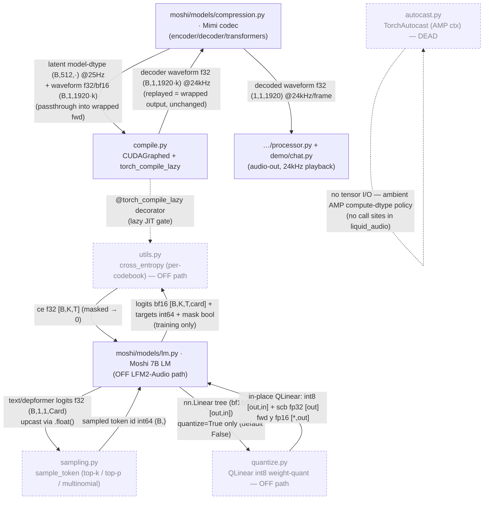

<!-- topic: Moshi Utilities -->
# Moshi Utilities (off path)

Off-path helper modules of the Kyutai Moshi stack — CUDA graphs, sampling, autocast, int8. Each `##` keeps its architecture code.

---

## Moshi utilities (CUDA graphs, sampling, autocast)

This folder is the **execution-plumbing toolbox** of Kyutai's vendored Moshi tree: CUDA-graph capture/replay + `torch.compile` gating, AMP autocast context management, the Moshi-LM next-token sampler, bitsandbytes int8 weight quantization, and the Moshi-LM training cross-entropy. None of these do codec/backbone tensor math themselves — they wrap or accelerate modules that live elsewhere. On the **LFM2-Audio mic→wav inference path only one component runs**: `compile.py` (`CUDAGraphed` / `torch_compile_lazy`), and even that is **numerically inert** — pure latency orchestration that wraps the Mimi codec on CUDA and degrades to an identity passthrough off-CUDA. Everything else here (`sampling.py`, `autocast.py`, `quantize.py`, `utils.py`) belongs to the off-path Moshi 7B LM / training stack and is **dormant or dead** in this checkout.

## Wiring

Solid edges into/out of `compile.py` ↔ the Mimi codec are the **only on-path tensor flow**. Dashed nodes (`sampling.py`, `autocast.py`, `quantize.py`, `utils.py`) are off the LFM2-Audio path. `autocast.py` has a self-loop because it produces no tensor and has zero call sites in `liquid_audio`.

## Components

| Component | File | dtype in → out | One-line role | Spec |
|---|---|---|---|---|
| `moshi_util_compile` | `compile.py` | passthrough: model-dtype latent `(B,512,·)` @25Hz / waveform f32·bf16 `(B,1,1920·k)` → **same** wrapped output, decoder waveform **f32** `(B,1,1920·k)` @24kHz | CUDA-graph capture/replay + `torch.compile` lazy-gating wrapping Mimi's encoder/decoder/transformers; numerically inert, disabled off-CUDA, no Rust counterpart (candle eager). **ON path.** | [./compile.md](Moshi-Utilities) |
| `moshi_util_sampling` | `sampling.py` | f32 logits `(…,Card)` (callers `.float()`-upcast) → int64 token id `(…,)` squeezed | Standalone Moshi-7B-LM next-token sampler (greedy argmax / temp-softmax + sort-cumsum top-p / gather top-k + sync-free multinomial). **OFF path** — LFM2-Audio uses its own inline threshold-top-k samplers. | [./sampling.md](Moshi-Utilities) |
| `moshi_util_autocast` | `autocast.py` | no tensor I/O — ctor args `enabled:bool` + `torch.autocast(device_type, dtype=bf16/f16)`; `__enter__` → `None` | `torch.autocast` on/off context-manager wrapper (AMP compute-dtype policy). **OFF path & DEAD** — vendored, no call sites in `liquid_audio`. | [./autocast.md](Moshi-Utilities) |
| `moshi_util_quantize` | `quantize.py` | `nn.Linear.weight` bf16/f32 `[out,in]` → int8 `[out,in]` + `weight_scb` fp32 `[out]`; fwd `x` any-float `[*,in]` → `y` fp16 `[*,out]` | bitsandbytes int8 weight-quant: `QLinear` (vector-wise int8 weight + fp32 scale, fp16-activation LLM.int8 matmul) + recursive `replace_linear_with_qlinear`. **OFF path** — Moshi LM/transformer only, `quantize=False` default; CUDA-only. | [./quantize.md](Moshi-Utilities) |
| `moshi_util_utils` | `utils.py` | logits bf16 `[B,K,T,card]` + targets int64 `[B,K,T]` + mask bool `[B,K,T]` → ce f32 `[B,K,T]` (masked positions zeroed) | Vendored Moshi-LM **training** utility: chunked per-codebook `cross_entropy` (manual logsumexp − gather, optional tanh soft-clip, f32 upcast). **OFF path** — not imported anywhere in this checkout. | [./utils.md](Moshi-Utilities) |

## How it fits

On the live LFM2-Audio path, **what enters this folder is one wrapped-module passthrough**: the Mimi codec (`moshi/models/compression.py`) constructs four `CUDAGraphed` wrappers in its streaming state and hands them its encoder/decoder/transformer modules plus per-frame tensor args — latent `(B,512,·)` @25Hz model-dtype and/or waveform f32/bf16 `(B,1,1920·k)`. **What leaves is bit-identical to what would have left without the wrapper**: the replayed graph re-runs the captured kernels in place and returns the wrapped module's own output — decoder waveform **f32 `(B,1,1920·k)` @24kHz** — which flows downstream to `…/processor.py` and `demo/chat.py` for 24 kHz playback (one f32 `(1,1,1920)` frame at a time). So `compile.py`'s upstream is the **`moshi/models/` (compression/Mimi)** folder and its downstream is the **top-level processor / demo audio-out** path; it adds latency on CUDA and nothing else. The only intra-folder edge is `utils.py`'s `cross_entropy` borrowing `compile.py`'s `@torch_compile_lazy` decorator — but `utils.py` has no caller here, so that edge never fires.

## Off the LFM2-Audio inference path (explicit)

Four of the five components in this folder **do not run** on the LFM2-Audio mic→wav path:

- **`sampling.py`** — the **Moshi 7B LM** sampler. LFM2-Audio reimplements sampling inline (`_sample_text_token` / `_sample_audio_frame` in `model/lfm2_audio.py`) with a *threshold* top-k (keeps ties at the k-th value) and **no top-p**, so it is not interchangeable with this fixed-`k`-gather sampler. Off-path; the Rust analog is `candle_transformers::generation::LogitsProcessor`, not a port of this file.
- **`autocast.py`** — **dead vendored code**: `TorchAutocast` has zero call sites in `liquid_audio`. The autocast the codebase actually uses is `accelerator.autocast()` (trainer) and `torch.amp.autocast(enabled=False)` guards (mel front-end / conformer), none routing through this class. The Rust port has no analog by design (explicit per-op dtype).
- **`quantize.py`** — Moshi-LM/transformer-only int8 weight quantization, gated by `quantize=True` (default **False** at both call sites) and **CUDA-only** (bitsandbytes). The LFM2-Audio backbone (`Lfm2Model` + depthformer) and the Mimi codec run full-precision bf16; no port.
- **`utils.py`** — the **Moshi 7B LM training** cross-entropy, with **no importer anywhere in this checkout**. LFM2-Audio's own loss uses stock `F.cross_entropy(reduction="none")` (`model/lfm2_audio.py:460,462`), a different code path (ported as `candle_ext::loss::cross_entropy_none`).

Only **`compile.py`** is on the inference path, and it is a numerically inert latency layer (disabled off-CUDA, no Rust counterpart since candle runs Mimi eagerly).

---

## MU01 · Moshi sampler (top-k/top-p)
**Code:** `MU01` · **Source:** `moshi/utils/sampling.py` · **Rust:** `candle LogitsProcessor (analog)` · **On the LFM2-Audio inference path:** no

## Role
A 128-line standalone next-token sampler for the **Moshi 7B LM** (`moshi/models/lm.py`), not for LFM2-Audio. It provides `sample_token(logits, use_sampling, temp, top_k, top_p)` — greedy argmax, or temperature-softmax with classic (sort/cumsum) top-p or top-k — plus a sync-free `multinomial` specialization. It lives in the vendored Kyutai tree and is reused only by the Moshi LM and Moshi TTS; **LFM2-Audio uses its own inline samplers** (`_sample_text_token` / `_sample_audio_frame` in `model/lfm2_audio.py`) with a different top-k convention, so this file never executes on the LFM2-Audio mic→wav path.

## How it works
Four functions, all operating on the last (candidate/`Card`) dimension. No grad, no state, pure tensor ops.

**`multinomial(input, num_samples, replacement=False)` (`sampling.py:15`)** — a `torch.multinomial` wrapper that flattens to `(-1, Card)` (`:31`) and, for the hot path `replacement=False, num_samples==1`, *avoids* `torch.multinomial`'s CUDA synchronization point with the Gumbel-max / exponential trick (`:43-46`): draw `q ~ Exponential(1)` (`empty_like(input_).exponential_(1)`), form `input_/q`, and take `argmax(dim=-1)`. This is the inverse-CDF identity `argmax_i(p_i / e_i)` with `e_i ~ Exp(1)` ≡ a categorical draw from `p` — same distribution as `multinomial`, but a single elementwise+argmax with no device sync. Otherwise it calls `torch.multinomial` directly (`:37`). Output is reshaped back to `input.shape[:-1] + (num_samples,)` (`:47`). Note: `input` here is a **probability** vector (or any non-negative weights), not logits.

**`sample_top_k(probs, k)` (`sampling.py:51`)** — `k = min(k, Card)` (`:60`), then `torch.topk(probs, k, dim=-1)` returns the `k` largest probs and their indices (`:61`); `multinomial(probs, 1)` samples a *position* within those `k` (`:62`); `indices.gather(-1, next_token)` maps the position back to the vocab id (`:63`). This is the **fixed-cardinality** top-k: exactly `k` survivors, ties at the boundary broken arbitrarily by `topk`. (Contrast with LFM2-Audio's threshold top-k below.)

**`sample_top_p(probs, p)` (`sampling.py:67`)** — nucleus sampling. Sort probs descending (`torch.sort`, `:76`), cumulative sum `probs_sum` (`:77`), build `mask = probs_sum - probs_sort > p` (`:78`) — i.e. keep a token iff the cumulative mass *strictly before* it is ≤ `p` (so the first token that crosses `p` is still kept). Zero out the masked tail by multiplying with `(~mask).float()` (`:79`), renormalize in place `probs_sort.div_(probs_sort.sum(-1, keepdim))` (`:80`), `multinomial(...,1)` over the truncated-renormalized distribution (`:81`), and `gather` the sorted index back to vocab space (`:82`).

**`sample_token(logits, use_sampling=False, temp=1.0, top_k=0, top_p=0.0)` (`sampling.py:86`)** — the dispatcher. If `use_sampling and temp > 0`: `probs = softmax(logits / temp, dim=-1)` (`:96`), then top-p if `top_p>0` (`:98`), else top-k if `top_k>0` (`:100`), else plain `multinomial` (`:102`). Else (greedy / `temp<=0`, the zero-division guard noted at `:94`): `torch.argmax(logits, dim=-1, keepdim=True)` (`:104`). Asserts the trailing sample dim is 1 and squeezes it (`:105-106`), returning shape `[*]`. **Precedence: top-p wins over top-k** when both are set — they are mutually exclusive here, unlike samplers that compose them.

**No softmax/argmax precision tricks beyond torch defaults.** `softmax` runs in the logits' dtype; the Moshi LM call sites upcast first — `sample_token(text_logits.float(), ...)` (`lm.py:730`, `:827`) — so the softmax effectively runs in **f32**. Temperature scaling is a plain `logits / temp` (no log-space). No streaming state; each call is independent.

**Why it is off the LFM2-Audio path.** `sample_token` is imported only at `moshi/models/lm.py:25` and called for the Moshi LM's text stream (`lm.py:730`) and its depformer codebooks (`lm.py:827`). LFM2-Audio's `_sample_text_token` (`lfm2_audio.py:486-497`) and `_sample_audio_frame` (`lfm2_audio.py:519-529`) reimplement sampling inline with a **threshold** top-k: `min_score = topk(logits, k).values[-1]; logits[logits < min_score] = -inf; multinomial(softmax(logits),1)` — which *keeps ties* at the k-th value (variable survivor count), the opposite of this file's fixed-`k` `gather`. They also have **no top-p** path. So the two samplers are not interchangeable.

## Dtypes & shapes
| Function | Input(s) | Output |
|---|---|---|
| `multinomial` | `input` probs `(…, Card)` float (Moshi: f32 after upcast) | `(…, num_samples)` int64 |
| `sample_top_k` | `probs (…, Card)` f32, `k:int` | `(…, 1)` int64 |
| `sample_top_p` | `probs (…, Card)` f32, `p:float` | `(…, 1)` int64 |
| `sample_token` | `logits (…, Card)` f32 (callers pass `.float()`); for Moshi text `Card=text_card`, depformer `Card=audio_card` | `(…,)` int64 (squeezed) |

Internal promotions: `(~mask).float()` upcasts the boolean mask to f32 for the multiply (`:79`); `exponential_` draws in `input`'s dtype. The Moshi LM forces **f32** softmax via `.float()` at the call site (`lm.py:730/827`). No f64 anywhere. Token ids returned are int64 (torch `argmax`/`multinomial` default LongTensor).

## Wiring
**Upstream (feeds this):**
- [moshi_lm](MM03-Moshi-LM) — Moshi LM text logits `f32 (B,1,1,text_card)` (`lm.py:730`, upcast via `.float()`) and per-codebook depformer logits `f32 (B,1,1,audio_card)` (`lm.py:827`). These are the *only* on-tree producers.
- [moshi_tts](MM05-Moshi-TTS) — drives the Moshi LM's `LMGen`, so it reaches this sampler transitively (off-path).

**Downstream (consumes this output):**
- [moshi_lm](MM03-Moshi-LM) — the sampled token id `int64 (B,)` is appended to the Moshi LM's text/audio streams and re-embedded for the next `lm_gen.step` (`lm.py` `LMGen`). This is the sole consumer.

**Not wired to:** [model_lfm2_audio](MD01-LFM2AudioModel) (uses its own threshold-top-k samplers), [core_processor](CO01-Processor-ChatState), or any LFM2-Audio decode component. There is no edge from this file into the LFM2-Audio tensor path.

## Python ↔ Rust
There is **no direct Rust port of `sampling.py`** — it belongs to the Moshi-LM reference subsystem, which is reused (not re-ported) from Kyutai's `moshi` crate. The *analogous* sampler that LFM2-Audio's Rust port actually runs is the `Sampler` struct in `model/lfm2_audio.rs:174-207`, built on `candle_transformers::generation::{LogitsProcessor, Sampling}`.

| Python (`sampling.py`) | Rust analog | Notes |
|---|---|---|
| `sample_token(...)` greedy branch (`:104`) | `Sampling::ArgMax` → `LogitsProcessor::sample_argmax` (`lfm2_audio.rs:189-190`) | `argmax(-1)`; deterministic ⇒ parity preserved (depthformer token-exact). |
| `sample_token(...)` stochastic (`:96-102`) | `Sampling::All { temperature }` → `LogitsProcessor::sample` (`lfm2_audio.rs:193`) | temperature softmax + multinomial. |
| `sample_top_k` fixed-`k` gather (`:51-64`) | `torch_topk_mask` via `LogitsProcessor::sample_f` (`lfm2_audio.rs:202,215-228`) | Rust mirrors **LFM2-Audio's threshold top-k** (`p < min_score → 0`, ties kept), *not* this file's fixed-`k`. candle's built-in `Sampling::TopK` keeps exactly `k` and was deliberately bypassed. |
| `sample_top_p` (`:67-83`) | (none) | LFM2-Audio has no top-p; not implemented in the port. |
| `multinomial` Gumbel/exponential no-sync trick (`:43-46`) | candle `WeightedIndex` (rand_pcg) inside `LogitsProcessor` | Different RNG stream; not byte-reproducible by design. |

**Deliberate divergences** (per `PYTHON_VS_RUST.md`): §2.3 "Sampling → `candle_transformers::generation::LogitsProcessor` (the sampler moshi itself uses), wrapped by a `Sampler` that injects Torch's threshold-style top-k via the `sample_f` hook; greedy = `ArgMax`"; §2.8 stochastic RNG is `rand_pcg`, not torch's `multinomial` generator — "the token set and proportional distribution match, but not byte-reproducible." Greedy is fully deterministic and identical.

## Precision / gotchas
- **Wrong model.** Do not treat this as the LFM2-Audio sampler — it is the **Moshi LM** sampler. The two differ in top-k semantics (fixed-`k` gather here vs threshold-`< min_score` in LFM2-Audio) and in top-p support (present here, absent in LFM2-Audio).
- **top-p vs top-k mutual exclusion.** `sample_token` checks `top_p>0` *before* `top_k>0` (`:97-100`); you cannot stack them, and top-p silently wins.
- **`temp<=0` guard.** `temp` at or below 0 (or `use_sampling=False`) routes to greedy argmax to dodge the `logits/temp` zero-division (`:94-95`) — so "temperature 0" means deterministic, never a degenerate softmax.
- **`multinomial` expects probabilities, not logits.** `sample_top_k/top_p` pass already-softmaxed `probs`; the no-sync trick `input_/q` assumes non-negative weights. Feeding raw logits would be a silent correctness bug.
- **top-p keep-rule off-by-one.** The mask `probs_sum - probs_sort > p` (`:78`) keeps the *first* token that crosses `p` (compares cumulative-before-this-token), so the nucleus always contains ≥1 token even when `top1 > p`.
- **RNG non-reproducibility.** Stochastic draws are not byte-reproducible across the torch reference and the candle analog (different generators); only greedy/argmax matches bit-for-bit. EOAudio (code 2048) and EOS handling are decided by the *callers* (`generate_interleaved` / `LMGen`), not by this sampler — it only returns the argmax/multinomial index.

---

## MU02 · CUDAGraphed + torch.compile gating
**Code:** `MU02` · **Source:** `moshi/utils/compile.py` · **Rust:** `- (candle eager)` · **On the LFM2-Audio inference path:** yes

## Role
This is the **CUDA-graph capture/replay + torch.compile gating layer** for Kyutai's vendored Mimi codec (and the off-path Moshi 7B LM). It does **no tensor math** of its own — it is pure execution-orchestration infrastructure that wraps an existing `nn.Module.forward` so that, on CUDA, the per-frame streaming call becomes a captured-and-replayed CUDA graph (eliminating per-step kernel-launch overhead) and hot pointwise functions get JIT-compiled lazily. Everything in this file is a **no-op / identity passthrough off CUDA**, which is exactly how the Rust candle port treats it: there is no Rust counterpart class — candle runs the same modules eagerly. It exists on the inference path only because `CUDAGraphed` wraps Mimi's encoder/decoder/transformers (`compression.py:225-229`) used to decode the model's 8-codebook audio frames into 24 kHz waveform.

## How it works
This file is **control-flow infrastructure**, not a forward pass; the "mechanism" is the graph state machine and the gating predicates.

**`torch_compile_lazy(fun)` (`compile.py:37-54`)** — a decorator that defers `torch.compile(fun)` until first *call* (so importing the module never spawns torch's compile worker pool). On each call: if env `NO_TORCH_COMPILE` is set it returns the raw `fun` (line 41); if the module-global `_compile_disabled` flag is set it calls `fun` eagerly (line 48-49); otherwise it lazily compiles once and caches `fun_compiled` (line 50-52). The `no_compile()` context manager (`compile.py:24-34`) flips `_compile_disabled` true/false around a `yield`, restoring the previous value (re-entrant). This decorator is applied to the codec's pointwise kernels elsewhere — `apply_rope` (`rope.py:11`), `_rms_norm` (`transformer.py:36`), `gating_forward_kernel` (`gating.py:13`) — so it indirectly governs RoPE, the codec-transformer RMSNorm, and the gated-FFN activation.

**`CUDAGraphed` (`compile.py:190-280`)** — the core. Wraps a callable whose tensor args must be **top-level positional** (no nested structures, no kwargs — `__call__` raises if `kwargs` present, line 219-220). State: `_graph` (a `cuda.CUDAGraph`), `_output` (the captured output tuple), `_args` (the captured *input* tensor buffers), and a `warmup_steps` counter.

The `__call__` decision tree:
1. **Bypass** (line 221-222): if `self.disable`, or `_is_cuda_graph_enabled()` is false, or we are already nested inside a graph (`in_cuda_graph()`), just call `self.func(*args)` — full passthrough.
2. **Warmup** (line 273-275): while `warmup_steps > 0`, decrement and run eagerly. This lets any `torch.compile`'d sub-functions finish compiling *before* capture (a graph can't be captured around an in-progress compile).
3. **Capture** (line 263-272): when warmup is exhausted and `_graph is None`, allocate a `cuda.CUDAGraph`, **clone the input tensors into persistent buffers** (`_clone_tensors`, line 224-230 — so the captured graph owns stable input addresses), capture `self._output = self.func(*self._args)` under `with cuda.graph(self._graph)`, then `replay()` once (line 271) because capture itself runs nothing real, and return `_output`.
4. **Replay** (line 276-280): on every subsequent call, `_match_values_copy_tensors` (line 232-259) validates each arg against the captured one — tensor args must keep **identical shape** (raises with a `NO_CUDA_GRAPH=1` hint otherwise, line 243-249) and are `copy_`'d into the persistent input buffers; non-tensor args must be unchanged by value (line 256-259). Then `_graph.replay()` re-runs the captured kernels in place and returns the *same* `_output` tensor objects (their storage was overwritten by the replay). `reset()` (line 210-216) nulls `_graph/_output/_args` so the next call re-captures — used when KV-cache or shapes change.

**Enable/disable predicates.** `_is_cuda_graph_enabled()` (`compile.py:169-175`): false if module-global `_disable_cuda_graph` is set, or if env `NO_CUDA_GRAPH` is a non-empty non-`{0,no,n}` string; else true. `no_cuda_graph()` (line 178-187) is the scoped disable. `in_cuda_graph()`/`_set_in_cuda_graph()` (line 153-166) maintain a reentrancy guard so nested `CUDAGraphed` calls degrade to eager (only the outermost wrapper captures).

**`cuda_graph(func, warmup_steps=1)` (`compile.py:283-287)`** — convenience factory: returns `func` unchanged when graphing is globally disabled, else `CUDAGraphed(func, warmup_steps)`.

**`Checkpoint` / `simple_checkpoint` (`compile.py:57-146`)** — a hand-rolled `torch.autograd.Function` activation-checkpoint (forward under `no_grad`, recompute in backward) that is FSDP- and compile-safe. This is **training-only** and **off the inference path**; it never runs during LFM2-Audio generation.

**The single binding fact for this component's relevance:** in Mimi's `_init_streaming_state` (`compression.py:218-229`), `disable = device.type != 'cuda'` (line 220), and that `disable` is passed into every `CUDAGraphed(...)` wrapping `encoder_transformer`, `decoder_transformer`, `encoder`, `decoder`. So on CPU/MPS the codec's per-frame decode runs eager; only on a CUDA box does the streaming decode become a replayed graph.

## Dtypes & shapes
This component is **dtype- and shape-transparent**: it neither casts nor reshapes. It only *asserts* that replay-time tensor args match capture-time shape/dtype exactly (`compile.py:243-250`), and `copy_`'s values in place. The dtypes/shapes below are those of the *wrapped* Mimi callables it passes through unchanged.

| Wrapped callable (via `CUDAGraphed`) | Input dtype+shape (passthrough) | Output dtype+shape (passthrough) |
|---|---|---|
| `encoder` (`compression.py:228`) | waveform f32/bf16 `(B,1,1920·k)` | latent model-dtype `(B,512,k·…)` @25Hz |
| `decoder` (`compression.py:229`) | latent model-dtype `(B,512,·)` @25Hz | waveform **f32** `(B,1,1920·k)` @24kHz |
| `encoder_transformer` / `decoder_transformer` (`compression.py:225,227`) | model-dtype `(B,512,T')` | model-dtype `(B,512,T')` |
| `torch_compile_lazy` kernels (`apply_rope`/`_rms_norm`/`gating_forward_kernel`) | model-dtype (bf16 cuda) tensors | same dtype, same shape |

No internal promotions occur here — the f32-upcast-for-RMSNorm, the bf16 codec weights, the int Mimi codes (u32 in Rust) all live in the wrapped modules, not in this file.

## Wiring
**Upstream (who constructs/feeds this):**
- [moshi_compression](MM01-Mimi-Codec) builds the four `CUDAGraphed` wrappers in `_MimiState` and drives them per streaming frame (edge: latent model-dtype `(B,512,·)` @25Hz / codes int into the wrapped encoder/decoder; nothing flows *into* `compile.py` except the modules + tensor args).
- [moshi_streaming](MO06-Streaming-Module) wraps `_set_exec_mask` in `CUDAGraphed` (`streaming.py:36,209`).
- [moshi_transformer](MO03-Codec-Transformer), [moshi_gating](MO07-Gating), [moshi_rope](MO05-RoPE), [moshi_lm](MM03-Moshi-LM) (off-path) apply `torch_compile_lazy` / `CUDAGraphed` to their hot functions.

**Downstream (who consumes this component's output):** the *replayed* output is just the wrapped module's output, so the real consumer is whoever consumes Mimi's decode — i.e. the demo/processor audio-out path:
- [moshi_compression](MM01-Mimi-Codec) consumes the graphed encoder/decoder output (latent @25Hz, waveform f32 `(B,1,1920)`).
- [core_processor](CO01-Processor-ChatState) / [demo_chat](DM01-Realtime-Chat) consume the resulting waveform **f32 `(1,1,1920)` @24kHz** per frame to play audio.

## Python ↔ Rust
There is **no Rust file** for this component — by design (`PYTHON_VS_RUST.md §2.3` "upstream reuse", `ARCH_1_MIMI_CODEC.md §4,§7.3`). The mapping is *deletion-by-equivalence*:

| Python symbol | Rust | Divergence (deliberate) |
|---|---|---|
| `CUDAGraphed`, `cuda_graph` | — (none) | candle runs Mimi (the `moshi` crate) **eager**; no CUDA-graph capture layer exists. `disable = device.type != 'cuda'` (`compression.py:220`) means Python *itself* runs this eager off-CUDA, so on CPU/Metal the two are identical execution (`PYTHON_VS_RUST.md §2.1`). |
| `torch_compile_lazy`, `no_compile` | — (none) | no JIT-compile concept in candle; ops are dispatched directly. The decorated kernels (RoPE, codec RMSNorm, gated FFN) are ported as plain candle ops in the `moshi` crate / `transformer.rs`. |
| `Checkpoint`, `simple_checkpoint` | — (omitted) | no autograd/backward in the inference port → no activation checkpointing. |
| `in_cuda_graph`/`no_cuda_graph`/`_is_cuda_graph_enabled` | — | no graph state machine to gate. |

This is the same class of divergence as `moshi_util_autocast` (`TorchAutocast` → candle no-op) — torch execution-mode plumbing with no semantic effect on the numbers.

## Precision / gotchas
- **Numerically inert.** This file changes *no* values; it only affects *latency* on CUDA. The 1e-6 cross-library floor (`PYTHON_VS_RUST.md §1.4`) is unrelated to this component. A graph-replayed Mimi and an eager Mimi are bit-identical on the same device — `CUDAGraphed` literally re-runs the captured kernels.
- **Shape-frozen replay.** The load-bearing gotcha: once captured, **every call must use the exact same tensor shapes** (`compile.py:243-249`). This is why Mimi streaming requires input lengths that are exact multiples of `frame_size=1920` (`ARCH_1_MIMI_CODEC.md §5`) — the per-frame call shape must be constant for replay to be valid; a ragged frame would trip the shape assertion. `reset()` (line 210) is the escape hatch when KV-cache/shape changes.
- **Stable input buffers.** `_clone_tensors` at capture (line 224-230) plus `copy_` at replay (line 250) means the graph owns persistent input addresses; callers must not assume the returned `_output` is a fresh allocation each call — it is the **same tensor object** overwritten by replay (aliasing hazard if held across frames).
- **Off-CUDA = pure passthrough.** `disable=True` (CPU/Metal) makes `__call__` return `self.func(*args)` verbatim (line 221-222), so the Rust port's absence of this layer is faithful, not a gap.
- **Training-only `Checkpoint`.** Do not conflate the activation-checkpoint `autograd.Function` with the CUDA-graph path; it has no role in generation and is a `// PORT:` stub in Rust.

---

## MU03 · TorchAutocast
**Code:** `MU03` · **Source:** `moshi/utils/autocast.py` · **Rust:** `- (explicit dtype)` · **On the LFM2-Audio inference path:** no

## Role
`TorchAutocast` is a thin wrapper around `torch.autocast` (PyTorch AMP / mixed-precision context manager) that adds an *enable/disable toggle* and a friendlier error message. It exists so cluster code can flip mixed-precision on or off per-architecture/per-machine (different GPUs have different bf16/f16 support) without sprinkling `if enabled:` branches at every call site. It is **vendored Kyutai/Moshi machinery** carried in wholesale with the rest of `moshi/`; in `liquid_audio` this exact class is **dead code** — nothing imports or constructs it (grep for `TorchAutocast` matches only its own definition). The autocast that the LFM2-Audio code actually uses is `accelerator.autocast()` in the trainer and the conformer's `avoid_float16_autocast_context` / `torch.amp.autocast(enabled=False)` guards in the mel front-end, none of which route through this file.

## How it works
This is a context-manager utility, not a tensor op — there is no forward pass, no norm, no attention, no RoPE, no convolution. The mechanism is entirely Python context-manager plumbing over `torch.autocast`:

- **Construction** (`autocast.py:26-27`): `__init__(self, enabled, *args, **kwargs)` eagerly builds `self.autocast = torch.autocast(*args, **kwargs)` when `enabled` is truthy, else stores `None`. The `*args, **kwargs` are forwarded verbatim to `torch.autocast` (e.g. `device_type="cuda"`, `dtype=torch.bfloat16`/`torch.float16`, `cache_enabled=...`). So "enabled=False" is a true no-op: the wrapped object is `None` and never touches PyTorch's autocast state machine.
- **Enter** (`autocast.py:29-40`): `__enter__` returns immediately if `self.autocast is None` (the disabled path). Otherwise it delegates to `torch.autocast.__enter__()`, which pushes a dtype-casting policy onto PyTorch's dispatcher: while the context is live, eligible ops (matmul/conv/linear/SDPA) auto-cast their *inputs* to the autocast `dtype` (typically bf16/f16), while precision-sensitive reductions (softmax, layernorm/rmsnorm internals, loss) are kept in f32 by PyTorch's autocast op allow/deny lists. If `torch.autocast.__enter__()` raises `RuntimeError` (e.g. the GPU/driver can't honor the requested fast dtype), it re-raises with a hint to use `autocast_dtype=float16`, reading back `self.autocast.device` and `self.autocast.fast_dtype` for the message (`autocast.py:34-40`).
- **Exit** (`autocast.py:42-45`): symmetric — no-op when `None`, otherwise pops the autocast policy via `torch.autocast.__exit__(*args, **kwargs)`, restoring the prior dispatcher state.

Key behavior to note as "mechanism": **autocast never changes stored weight dtypes**; it only changes the *compute* dtype of dispatched ops inside the `with` block by casting operands. That distinction is exactly why the inference port can drop it — in the port, compute dtype is set explicitly per tensor/op rather than inferred from an ambient thread-local context.

Where the *concept* actually bites in this codebase (none of it through `TorchAutocast`):
- Training wraps the model call in `with self.accelerator.autocast():` (`trainer.py:176`, `trainer.py:194`) so the bf16 forward runs under HuggingFace Accelerate's autocast, with the loss accumulated in f32.
- The mel front-end deliberately *disables* autocast to keep full f32 range through the STFT/log: `with torch.amp.autocast(x.device.type, enabled=False):` (`conformer/processor.py:444`, `conformer/processor.py:468`).
- The conformer attention guards against an active **f16** autocast by forcing bf16-or-f32 compute via `avoid_float16_autocast_context()` (`conformer/utils.py:25-38`, used at `conformer/mha.py:266,270,391,395`).

## Dtypes & shapes
This component manipulates an ambient *compute-dtype policy*, not a tensor; it has no input/output tensor shape of its own. The table describes the dtype effect of the context on tensors that flow through ops dispatched inside it.

| Aspect | Disabled (`enabled=False`) | Enabled (`enabled=True`, typical) |
|---|---|---|
| Input to `__init__` | `enabled: bool`, `*args/**kwargs` for `torch.autocast` | same |
| Wrapped object | `None` | `torch.autocast(device_type=..., dtype=bf16/f16)` |
| Effect on op operands inside `with` | unchanged (caller's dtype, e.g. bf16 weights / f32 mel) | matmul/conv/linear/SDPA operands cast to autocast dtype (bf16/f16) |
| Kept in f32 by PyTorch policy | n/a | softmax, norm internals, loss reduction (autocast deny-list) |
| Weight storage dtype | never modified | never modified (bf16 on disk stays bf16) |
| Return of `__enter__` | `None` | `None` (used as plain `with`, no `as` target) |

Reference global dtypes for context (set elsewhere, merely *observed* by autocast): backbone/codec weights bf16 on disk; Python default compute bf16 on cuda; mel computed in f32/f64 with autocast explicitly off; token ids int64.

## Wiring
**Upstream (who would construct it):** in `liquid_audio`, **nobody** — `TorchAutocast` has zero call sites. In upstream Moshi it is constructed by the Moshi LM / solver code (out of this repo's path). The conceptually-adjacent, actually-used autocast in this codebase comes from the trainer ([core_trainer](CO04-Trainer), via `accelerator.autocast()`) wrapping the model forward, and from the mel front-end ([conformer_processor](CF04-Mel-Frontend)) and conformer attention ([conformer_mha](CF02-RelPos-MHA) + [conformer_utils](CF06-Conformer-Utils)) toggling autocast off / away from f16.

**Downstream (who consumes its output):** none. It produces no tensor and no value (`__enter__` returns `None`). On the LFM2-Audio inference path there is no consumer. The only "consumer" of the *concept* is the trainer's bf16 forward + f32 loss, i.e. [core_trainer](CO04-Trainer) — and that path uses `accelerator.autocast()`, not this class.

## Python ↔ Rust
**Symbol mapping:** `TorchAutocast` → **no Rust symbol** (`- (explicit dtype)`). This is a deliberate, documented divergence, not a missing port:

- **PORT_STATUS.md** records "torch autocast (`avoid_float16_autocast_context`) — candle has no autocast; compute dtype is explicit." candle/Rust has no ambient thread-local mixed-precision dispatcher, so a context manager that mutates such state has nothing to wrap.
- **PYTHON_VS_RUST.md §2.1** (device & dtype defaults are explicit, device-agnostic) and **§2.4** (precision order is explicit per-op) are the umbrella rationale: every loader takes `device: &Device` + `dtype: DType`, and each op's compute dtype is chosen at the call site. The autocast "policy" is therefore inlined as concrete casts where they matter (e.g. RMSNorm composed to upcast to f32 for the norm + weight-multiply then cast back; mel run in f64→f32). **PYTHON_VS_RUST.md §2.6** maps `accelerator.autocast()` itself to "candle equivalents" — the model already runs at the load dtype and the loss is computed in f32 inside the model, so there is **no separate cast context** (`trainer.rs:21`, `trainer.rs:429-431`).
- The one piece of autocast logic that *was* ported is the conformer guard, as a **pure function**: `avoid_float16_autocast_context(autocast_dtype, bf16_supported) -> Option<DType>` (`conformer/utils.rs:74`) reproduces the decision "f16 active → bf16 if supported else f32; otherwise no override" without any global state. `TorchAutocast` itself has no analog because it is unused.

## Precision / gotchas
- **Dead vendored code.** Do not treat the absence of a Rust `TorchAutocast` as a port gap — the Python class is never instantiated in `liquid_audio`. Mis-reading this as "missing" would be a false positive.
- **Autocast ≠ weight cast.** It changes *op compute* dtype by casting operands inside the block, never the stored bf16 weights. The port's "explicit dtype" model is faithful precisely because it controls those op-level dtypes directly.
- **f16-vs-bf16 hazard the wrapper exists for.** The friendlier `RuntimeError` (`autocast.py:34-40`) is about hardware that rejects the requested fast dtype; the real codebase handles the analogous hazard at the conformer (`avoid_float16_autocast_context`), forcing bf16/f32 so f16's narrow range never corrupts attention scores.
- **Front-end must stay un-autocast.** The mel/STFT is precision-sensitive and is wrapped in `autocast(enabled=False)` (`processor.py:444,468`); the Rust port honors this by running the mel in f64→f32 on CPU (PYTHON_VS_RUST.md §1.4) rather than relying on any ambient context. If autocast policy ever leaked into the front-end it would silently degrade the STFT — which is exactly the failure mode `enabled=False` guards against.
- **No off-by-one / special-token concerns** apply here — this component touches no codes, no EOAudio, no sampling.

---

## MU04 · int8 quantize helpers
**Code:** `MU04` · **Source:** `moshi/utils/quantize.py` · **Rust:** `-` · **On the LFM2-Audio inference path:** no

## Role
A 58-line bitsandbytes (`bnb`) int8 weight-quantization helper vendored from Kyutai's Moshi. It defines `QLinear` — a drop-in replacement for `nn.Linear` whose weight is stored as an int8 vector-wise-quantized matrix plus an fp32 per-row scale — and `replace_linear_with_qlinear`, which recursively swaps every `nn.Linear` in a module tree for a `QLinear`. It exists to shrink the **Moshi 7B LM** (`lm.py`) and the Moshi codec/projection `StreamingTransformer` (`transformer.py`) for low-VRAM inference. It is **off the LFM2-Audio path**: LFM2-Audio uses its own HF `Lfm2Model` backbone + depthformer (full-precision bf16), never the Moshi LM, and both call sites default `quantize=False`.

## How it works
Two symbols, both thin wrappers around bitsandbytes' LLM.int8() (`int8_vectorwise_quant` + `MatmulLtState`) machinery.

**`QLinear.__init__(linear)`** (`quantize.py:13-22`) — bias-free, float-only constraint:
- Asserts the source weight is floating point (`:18`) and that there is **no bias** (`:19`); `QLinear.forward` never adds a bias, so a biased `Linear` would silently lose it — the assert makes that a hard error.
- `CB, SCB, _ = bnbF.int8_vectorwise_quant(weight.data.to(torch.float16))` (`:20`). The weight is cast bf16/f32 → **fp16** first, then quantized **per output row (vector-wise)**: each row of the `[out, in]` weight is scaled by its own absmax so the int8 range `[-127,127]` spans that row. `CB` = int8 quantized weight `[out,in]`; `SCB` = fp32 scale, one entry per output row `[out]` (`SCB = row_absmax / 127`); the discarded third return is the per-row outlier mask / `outlier_cols` unused here.
- Stores `CB` as `self.weight` and `SCB` as `self.weight_scb`, both `requires_grad=False` (`:21-22`). The `_scb` suffix is the on-disk convention the Moshi `transformer.py` state-dict loader keys off (`transformer.py:422` "_scb suffix is for quantized data", `:443` `isinstance(in_proj, QLinear)`).

**`QLinear.forward(x)`** (`quantize.py:24-40`) — LLM.int8() mixed-precision matmul:
- Builds a fresh `bnb.MatmulLtState()` each call (`:26`), attaches `CB`/`SCB` (`:27-29`), and **guards the scale dtype**: if `SCB.dtype != torch.float` it raises (`:31-36`) — the named failure mode is a `.to(bfloat16)` on the whole model having dragged the scale to bf16 and destroyed precision. `has_fp16_weights=False` (`:37`) tells bnb the weights live in int8, not fp16.
- `y = bnb.matmul(x.half(), state.CB, state=state)` (`:38`): activations are cast to **fp16**, multiplied against the int8 weight via bnb's LLM.int8() kernel (int8×int8 GEMM in the inlier path, fp16 outlier-column fallback), then dequantized with `SCB`. Output `y` is fp16. There is **no causal mask, no norm, no activation** here — it is purely a quantized linear.

**`replace_linear_with_qlinear(module)`** (`quantize.py:43-57`) — recursive in-place swap:
- For each named child: if it is `nn.Linear`, replace it with `QLinear(child)` (`:46-47`). If it is **already** a `QLinear`, call `child.float()` (`:48-55`) to re-pin the fp32 scale — the long comment explains the LM calls this twice (once layer-by-layer to cap peak memory, once after full init) and a global `.bfloat16()` between the passes would have cast `weight_scb` to bf16; `.float()` undoes that. Otherwise recurse (`:56-57`). Must run **before** `load_state_dict` so the quantized param shapes/keys match the checkpoint.

Note this is a **weight-only int8** scheme (W8A16-ish: int8 weights, fp16 activations), distinct from the codec's **vector-quantization** (`core_vq`/`moshi_vq`, RVQ codebooks) — same word "quantize", unrelated mechanism.

## Dtypes & shapes
| Stage | Input | Output |
|---|---|---|
| `QLinear.__init__` weight | `Linear.weight` bf16/f32 `[out,in]` | `weight` int8 `[out,in]` + `weight_scb` fp32 `[out]` (after fp16 cast in `int8_vectorwise_quant`) |
| `QLinear.forward` | `x` any float `[*, in]` → cast `.half()` fp16 | `y` fp16 `[*, out]` (int8 weight × fp16 act, dequant by fp32 SCB) |
| `replace_linear_with_qlinear` | `nn.Module` tree | same tree, `nn.Linear` → `QLinear` in place (no tensor returned) |

Internal dtype facts: weight quant path is **f→fp16→int8** (`:20`); scale `SCB` is **fp32 and must stay fp32** (`:31-36`, re-pinned by `.float()` at `:55`); activations are forced **fp16** at matmul (`:38`); output is **fp16**. No bf16 path inside (bnb int8 kernels are fp16-coupled), no f64, no int64.

## Wiring
Off the LFM2-Audio tensor path; both edges live entirely inside the vendored Moshi LM stack and are dormant by default.

**Upstream (importers / callers):**
- `replace_linear_with_qlinear` imported by [moshi LM](../models/lm.py) (`lm.py:24`) and called at `lm.py:237` only when `LMModel(quantize=True)` — i.e. it walks the Moshi 7B `lm.py` module tree (full LM `nn.Linear`s) and swaps them. Edge: `nn.Module` tree (bf16/f32 Linear weights) → in-place QLinear.
- `replace_linear_with_qlinear` + `quantize` module imported by [moshi transformer](../modules/transformer.py) (`transformer.py:20-21`); called at `transformer.py:862` per-layer when `StreamingTransformerLayer(quantize=True)`; the in/out-proj state-dict loader special-cases `QLinear` at `transformer.py:443`. Edge: per-layer `nn.Linear` (the attention/FF projections) → QLinear.

**Downstream (consumers of QLinear output):** the dequantized fp16 activations feed straight back into the surrounding [moshi LM](../models/lm.py) / [moshi transformer](../modules/transformer.py) forward (attention, gated FFN, output heads) exactly where the original `Linear` output went — `QLinear` is API-transparent. No new tensor leaves the module.

No LFM2-Audio component ([core_processor](CO01-Processor-ChatState), [model_lfm2_audio](MD01-LFM2AudioModel), [model_transformer](MD04-Depthformer), [moshi_compression](MM01-Mimi-Codec)) imports or instantiates this; the codec and backbone run full-precision.

## Python ↔ Rust
**No Rust port (`Rust: -`).** Confirmed by grep: no `QLinear`/`int8_vectorwise`/`MatmulLtState`/`weight_scb` symbol anywhere under `liquid-audio-rs/src/`. This is a **deliberate omission**, consistent with two reference-doc choices:
- **PYTHON_VS_RUST.md §4 "Out of scope / reused, not ported":** the vendored Python `moshi/**` is reused as Kyutai's `moshi` crate, not re-ported, and `compare_symbols.py --scope core` **excludes** `moshi/` by design (so this file is not part of the 170/170 surface).
- **PYTHON_VS_RUST.md §2.3 "Upstream reuse":** the only Moshi piece the port actually exercises is `moshi::mimi` (the codec). The Moshi **LM** and its `quantize=True` finetune/inference knob are off-path (cf. the off-path `moshi_lora`, `moshi_lm`, `moshi_tts`), so its int8 helper has no call site to satisfy.

Had it been ported, the candle analog would be candle-transformers/candle-nn int8 GEMM (or a custom QMatMul over a stored int8 `Tensor` + f32 scale), since bitsandbytes is a CUDA-only C/PTX library with no candle equivalent — the same "CUDA-only kernel → portable candle op" pattern as PYTHON_VS_RUST.md §2.2, but here simply skipped because nothing on-path needs it.

## Precision / gotchas
- **CUDA-only dependency.** `bitsandbytes` int8 matmul requires an NVIDIA GPU; this module cannot run on CPU or Metal at all. It is one more reason it is absent from the device-agnostic Rust port (PYTHON_VS_RUST.md §2.1: Rust delivers the CPU/Metal design point, Python is CUDA-coupled).
- **The fp32-scale trap is real and load-bearing.** `weight_scb` must stay fp32. A global `model.bfloat16()`/`model.half()` after construction silently casts the scale, and the only thing catching it is the `forward`-time `RuntimeError` (`:31-36`) and the `.float()` re-pin in the double-pass swap (`:55`). The comment at `:49-54` is the canonical warning: quantize → set dtype in the wrong order = precision loss before the state dict even loads.
- **Bias is forbidden** (`:19`): `QLinear` drops bias entirely; swapping a biased `Linear` asserts rather than miscomputing.
- **Lossy by construction.** Per-row int8 (127 levels) + fp16 activations is far coarser than the bf16/f32 the rest of the stack uses; it trades accuracy for VRAM and is only ever opt-in (`quantize=False` default at both `lm.py:106` and `transformer.py:823`).
- **Naming collision.** This "quantize" is **weight int8**, unrelated to the RVQ/codebook "quantize" in [moshi_vq](QZ01-Split-RVQ)/[moshi_core_vq](QZ02-VQ-Core) and the `quantize=` flag on the codec's `set_num_codebooks` — do not conflate them. No EOAudio/special-token or off-by-one concerns apply here (no sequence logic in this file).

---

## MU05 · Moshi misc utils
**Code:** `MU05` · **Source:** `moshi/utils/utils.py` · **Rust:** `-` · **On the LFM2-Audio inference path:** no

## Role
A single vendored Moshi-LM training utility: a `@torch_compile_lazy`-decorated `cross_entropy` that computes **per-codebook** cross-entropy between a multi-stream LM's logits `[B,K,T,card]` and integer target codes `[B,K,T]`, masking out invalid timesteps. It exists because PyTorch's built-in `F.cross_entropy` is "super slow with large cardinality" (the comment at `utils.py:46-47`) for the multi-codebook audio LM, so Moshi reimplements it as a chunked manual log-partition. **It is not part of LFM2.5-Audio** — nothing in `liquid_audio` (and, as verified, nothing else in the vendored `moshi/` tree) imports it. LFM2-Audio's own training loss uses stock `nn.functional.cross_entropy(reduction="none")` at `model/lfm2_audio.py:460,462` instead. Despite the id-map gloss ("misc helpers, defaultdict, etc."), this file contains exactly one symbol: `cross_entropy`.

## How it works
The forward is a hand-rolled negative-log-likelihood reimplemented to dodge two PyTorch pain points (slow large-cardinality CE; f32-upcast OOMs), with optional logit soft-clipping (`utils.py:7-52`).

1. **Shape contract + flatten** (`:25-30`). Asserts `logits.shape[:-1] == targets.shape == mask.shape`. Records `output_shape = targets.shape` (`[B,K,T]`), then flattens: `logits → (-1, card)`, `targets → (-1,)`, `mask → (-1,)`. K (codebooks) and T (time) are collapsed into one row axis `N = B·K·T`; the per-codebook structure is preserved only by re-`view`ing at the end, so this is genuinely a per-codebook loss (no reduction across K).

2. **Safe targets** (`:32-36`). `safe_targets = where(mask, targets, 0)` — masked-out positions get a dummy class index 0 so the later `gather` is in-bounds; their contribution is zeroed afterward. `mask` is a boolean tensor; the fill value is `zeros(1, dtype=targets.dtype)` (an int code).

3. **Chunked manual cross-entropy in `dtype` (default f32)** (`:38-49`). To bound peak memory, both flattened `logits` and `safe_targets` are split into **4** chunks along the row axis (`torch.chunk(..., 4)`), and the f32 upcast + the rest happen per chunk:
   - `logits_chunk = logits_chunk.to(dtype)` — upcast bf16→f32 only on the live chunk (`:41`).
   - **Optional soft-clip** (`:42-43`): `logits = soft_clip · tanh(logits / soft_clip)` — a smooth bound to `±soft_clip` (recommended 30.0) for numerical stability; identity-like near 0, saturating at the extremes. Skipped when `logits_soft_clip is None`.
   - **Log-partition** (`:44`): `log_partition = logsumexp(logits_chunk, dim=-1, keepdim=True)` — the stable `log Σ exp` normalizer, i.e. `logZ`.
   - **Per-row NLL** (`:48`): `ce_chunk = log_partition − logits.gather(-1, target[...,None])`. This is exactly `−log softmax(logits)[target] = logZ − logit_target`, the cross-entropy of one row, but computed without materializing the full softmax. `gather` pulls the target class's logit; `[..., None]` adds the gather axis.

4. **Reassemble + re-mask + reshape** (`:49-52`). Concatenate the 4 chunks back to `(N,1)`, squeeze the gather axis (`ce[...,0]` → `(N,)`), then `where(mask, ce, 0)` to zero invalid timesteps (the safe-target dummies), and finally `view(output_shape)` back to `[B,K,T]`. Result dtype = `dtype` (f32).

Numerically `logsumexp − gather` is the standard stable CE identity; the only non-obvious choices are the **4-way chunking** (an OOM guard around the f32 upcast, not a math change) and the **soft-clip pre-nonlinearity** (a regularizer/stabilizer, off by default). The `@torch_compile_lazy` decorator (`:6`, from `moshi/utils/compile.py`) JIT-fuses the whole thing under `torch.compile` lazily on first call; it degrades to plain eager when compilation is disabled (off-CUDA / `no_compile`).

## Dtypes & shapes
| Tensor | dtype | shape |
|---|---|---|
| `logits` (in) | model dtype, typically bf16 (Moshi LM) | `[B, K, T, card]` |
| `targets` (in) | int64 codes | `[B, K, T]` |
| `mask` (in) | bool | `[B, K, T]` |
| `dtype` (param) | `torch.float32` default | — |
| `logits_soft_clip` (param) | f32 scalar or `None` | — |
| `safe_targets` (internal) | int64 (= `targets.dtype`) | `(N,)`, `N=B·K·T` |
| `logits_chunk` after `.to(dtype)` (internal) | **f32** (upcast) | `(N/4, card)` |
| `log_partition` (internal) | f32 | `(N/4, 1)` |
| `ce` (out) | f32 (= `dtype`) | `[B, K, T]` |

Internal promotions: bf16 logits are **upcast to f32 per chunk** before `logsumexp`/`gather` (the standard CE-in-f32 rule, here applied chunk-wise as an OOM guard). Targets stay int64 throughout. The mask is boolean and never participates in arithmetic except via `where`.

## Wiring
**Upstream (in Moshi, NOT in LFM2-Audio):** the Moshi multi-stream LM's text+audio logit heads produce `[B,K,T,card]` and the training pipeline supplies integer code targets + a validity mask. The natural caller would be Moshi's training/loss code paired with [moshi_lm](MM03-Moshi-LM) (the 7B multi-stream LM) and its sampler/loss utilities; `compile.py`'s `torch_compile_lazy` ([moshi_util_compile](Moshi-Utilities)) is its only intra-file dependency. **No call site exists in this checkout** — grep confirms zero importers across `moshi/` and `liquid_audio/`.

**Downstream:** none on the LFM2-Audio inference path. The function returns a `[B,K,T]` f32 loss tensor that a (here-absent) Moshi trainer would reduce/backward. For the LFM2-Audio analog of "per-element CE," see [model_lfm2_audio](MD01-LFM2AudioModel), whose `forward` calls stock `F.cross_entropy(reduction="none")` (`lfm2_audio.py:460,462`) — a *different* function, ported to Rust as `candle_ext::loss::cross_entropy_none`, not as a port of this file.

## Python ↔ Rust
**No Rust counterpart.** This `cross_entropy` is not ported because it has no call site in the inference port (the `core` parity scope explicitly excludes vendored `moshi/**`; see `PYTHON_VS_RUST.md` §4 "Out of scope / reused, not ported", and §2.3 which reuses the Mimi codec from the `moshi` crate rather than re-porting `moshi/` Python).

The superficially similar Rust symbol — `candle_ext::loss::cross_entropy_none` (`src/candle_ext/loss.rs:20`) — is the port of the **stock** `nn.functional.cross_entropy(reduction="none")` used by LFM2-Audio's own loss (`lfm2_audio.py:460,462` → `lfm2_audio.rs:581-582`), NOT of this Moshi helper. It differs in mechanism: it calls candle's `log_softmax` after a single f32 upcast over the whole tensor (no 4-way chunking, no soft-clip, no per-codebook `[B,K,T]` layout — it operates on flat `(N,C)`/`(N,)`). See `PYTHON_VS_RUST.md` §2.3 ("`cross_entropy(reduction="none")` → `candle_ext::loss::cross_entropy_none`"). The `@torch_compile_lazy` decorator maps to candle's no-op compile story (`PYTHON_VS_RUST.md` §2.2: CUDA-gated `torch.compile` → portable eager candle ops; `compile.md`).

## Precision / gotchas
- **f32 CE floor.** The upcast-to-f32-before-`logsumexp` is the same numerical rule the rest of the port honors for softmax/norm (`PYTHON_VS_RUST.md` §1.4); any port would inherit the cross-library `exp`/`logsumexp` last-bit floor (~1e-6) — but there is no port here, so this is informational.
- **Chunking is memory, not math.** The 4-way `torch.chunk` is purely an OOM guard around the f32 upcast (comment `:38`); it does not change results vs. an un-chunked computation (concat restores exact order). Do not mistake it for a streaming/blocked-softmax approximation — each chunk's `logsumexp` is over the full `card` axis, exact.
- **Masked positions read class 0.** `safe_targets` substitutes index 0 at masked rows so `gather` stays in-bounds; correctness depends on the **final** `where(mask, ce, 0)` zeroing them — if a caller dropped that second mask, masked rows would leak the CE of class 0. Both masks are load-bearing.
- **Soft-clip is opt-in.** `logits_soft_clip=None` by default; passing 30.0 bounds logits via `tanh` before `logsumexp` (changes the loss, intended as a stabilizer for the multi-codebook head). It is applied to logits *before* the partition, so it shifts both `logZ` and the gathered logit consistently.
- **Not LFM2-Audio's loss.** The single biggest gotcha: this is the **Moshi 7B** LM's loss, reference-only. LFM2.5-Audio's per-codebook `audio_loss_weights` weighting and `ignore_index=-100` masking live in `model/lfm2_audio.py:455-470`, using a different (stock-CE) code path. Citing this file as "the LFM2-Audio training loss" would be wrong.
